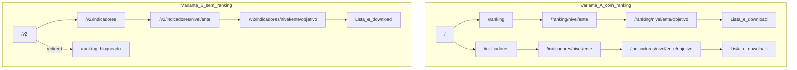

# Mapa de rotas públicas

| Metadado | Valor |
| --- | --- |
| **Audiência** | Cliente · Engenharia |
| **Status** | Canônico |
| **Última atualização** | 2026-09-13 |
| **Relacionados** | [Escopo e decisões](escopo-e-decisoes.md) · [Indicadores e ranking](../04-features/indicadores-e-ranking.md) · [Índice](../README.md) |

---

## 1. Variantes A e B (ranking)

| Variante | Como ativar | Comportamento |
| --- | --- | --- |
| **A** (com ranking) | `/` (padrão) ou `NEXT_PUBLIC_RANKING_MODE=on` | Ranking disponível na navegação e nas rotas `/ranking` |
| **B** (sem ranking) | Prefixo `/v2/…` **ou** `NEXT_PUBLIC_RANKING_MODE=off` | Ranking oculto; rotas `/ranking*` redirecionam; download via Indicadores |

O prefixo `/v2` força a variante B independentemente do env. Arquivos-chave: `src/proxy.ts`, `src/lib/features/ranking-mode.ts`.

---

## 2. Catálogo de rotas

| Rota | Propósito |
| --- | --- |
| `/` | Home (variante A) |
| `/v2` | Home da variante B (rewrite interno para o mesmo conteúdo com ranking off) |
| `/indicadores` | Explorer comparativo (nível, até 5 entes, objetivos ou temáticas) |
| `/indicadores/[nivel]/[ente]` | Detalhe do ente (drill-down) |
| `/indicadores/[nivel]/[ente]/[objetivo]` | Variáveis do objetivo + download (ambas as variantes) |
| `/ranking` | Explorer de ranking (apenas variante A) |
| `/ranking/[nivel]/[ente]` | Detalhe do ente no ranking |
| `/ranking/[nivel]/[ente]/[objetivo]` | Variáveis + UI de posição/distribuição |
| `/objetivos` | Catálogo dos 10 objetivos ENGD |
| `/objetivos/[slug]` | Detalhe do objetivo (inclui recomendações ENGD) |
| `/metodologia` | Hub do relatório metodológico + download do PDF |
| `/metodologia/[capitulo]` | Capítulo / anexo / referências |
| `/metodologia/fontes/[fonte]` | Página da pesquisa OBGD (links oficiais + CSV curado) |
| `/metodologia-completa.pdf` | PDF estático da metodologia completa |
| `/contato` | Formulário de contato (e-mail via Resend) |
| `/sobre` | Sobre o Observatório |
| `/publicacoes` | Publicações |

URLs antigas com `/municipal` ou `nivel=municipal` redirecionam (308) para `/municipios`.

---

## 3. Exemplos por nível

| Nível | Exemplo (variante A) | Exemplo (variante B) |
| --- | --- | --- |
| Federal | `/indicadores/federal/brasil/{objetivo}` | `/v2/indicadores/federal/brasil/{objetivo}` |
| Estadual | `/indicadores/estadual/sp/privacidade-e-seguranca` | `/v2/indicadores/estadual/sp/...` |
| Municípios | `/indicadores/municipios/{municipio}/{objetivo}` | `/v2/indicadores/municipios/...` |

### Query strings compartilháveis

- Indicadores: `nivel`, `entes`, `por`, `tema` — ex. `/indicadores?nivel=estadual&entes=sp,rj&por=objetivos`
- Ranking: `nivel`, `por`, `objetivo` \| `tema` — ex. `/ranking?nivel=municipios&por=objetivos&objetivo=privacidade-e-seguranca`

---

## 4. Rotas auxiliares de desenvolvimento

Existem páginas experimentais de home (`/home-v1`, `/home-v2`, `/home-v3`) usadas em iterações de design. A home canônica pública é `/` (e `/v2` na variante B).
