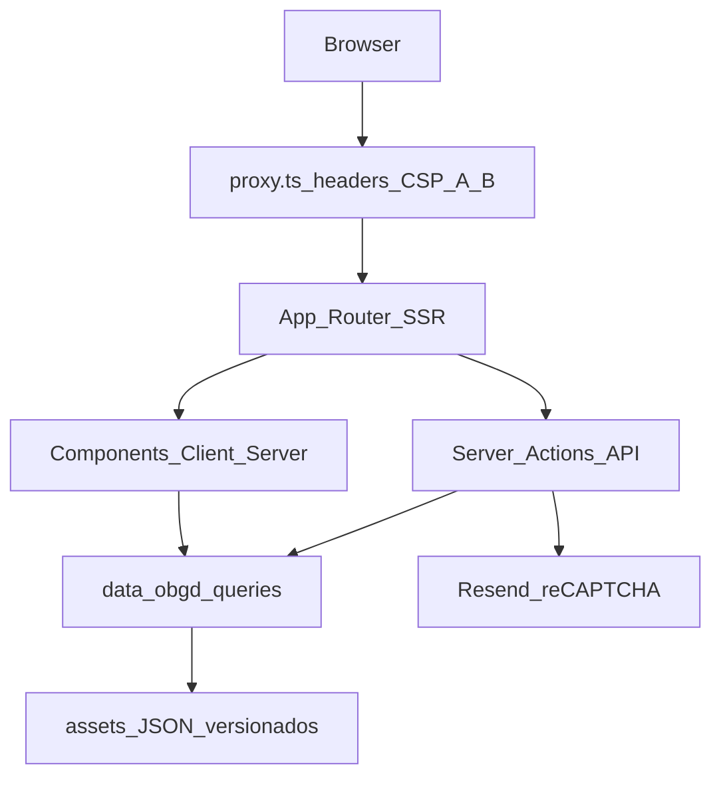
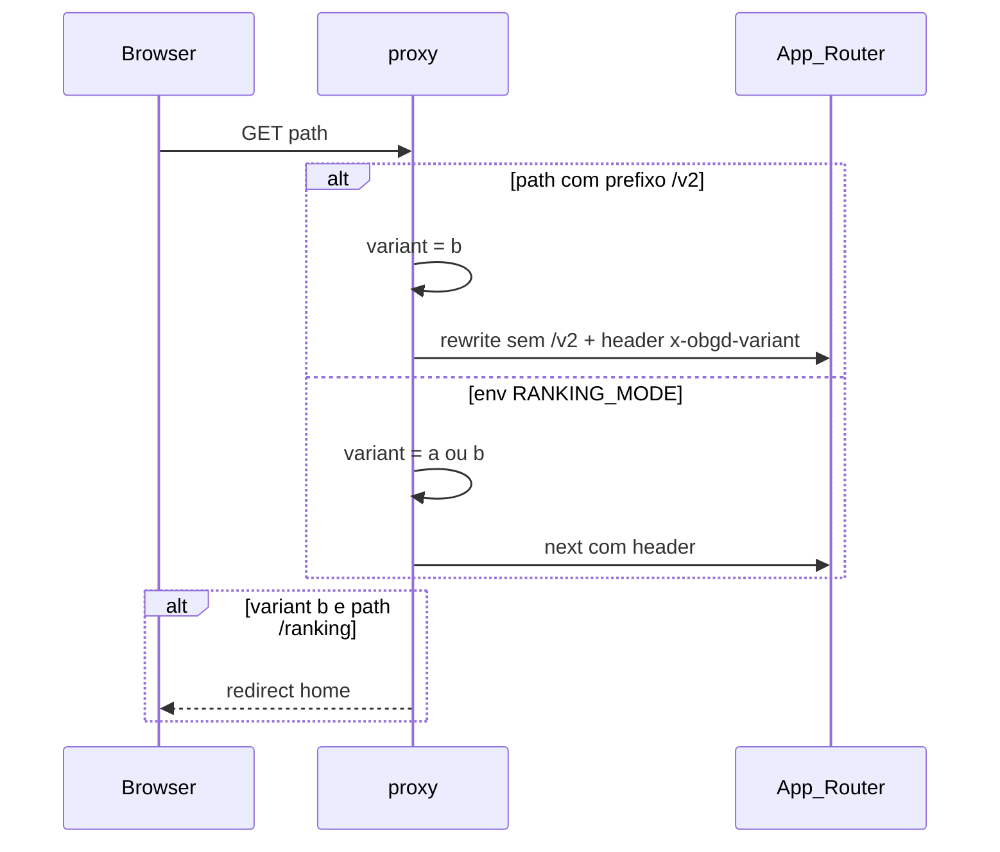

# Visão de arquitetura

| Metadado | Valor |
| --- | --- |
| **Audiência** | Engenharia |
| **Status** | Canônico |
| **Última atualização** | 2026-09-13 |
| **Relacionados** | [Stack e repositório](stack-e-repositorio.md) · [Pipeline OBGD](../03-dados/pipeline-obgd.md) · [Segurança](../05-operacao/seguranca-headers.md) · [Índice](../README.md) |

---

## 1. Visão em camadas

O portal é uma aplicação **Next.js (App Router)** em TypeScript. Não há banco de dados de aplicação nem CMS: os indicadores vêm de assets JSON versionados; o formulário de contato entrega mensagens por e-mail (Resend).

| Camada | Responsabilidade |
| --- | --- |
| **Proxy** (`src/proxy.ts`) | Variante A/B, redirects (`/municipal` → `/municipios`), CSP com nonce e headers de segurança |
| **App Router** | Rotas em `src/app/(app)/`; Server Components por padrão |
| **UI** | Componentes em `src/components/`; Client Components só quando há interatividade |
| **Server Actions / API** | Contato (`sendContactMessage`); export CSV (`GET /api/obgd/export`) |
| **Camada OBGD** | `src/data/obgd/` — load, queries, detalhes, export, tags |
| **Assets** | `src/data/obgd/assets/` — subset versionado no Git |

---

## 2. Renderização e CSP

O App Router injeta scripts inline de hidratação. A Content-Security-Policy usa **nonce por request**; o root layout chama `connection()` para garantir SSR alinhado ao nonce.

**Implicação:** o portal não é HTML estático puro no CDN — cada request de página passa por SSR. Detalhe: [Segurança (headers)](../05-operacao/seguranca-headers.md).

---

## 3. Variante A/B (feature ranking)

- Variante **A**: ranking habilitado.
- Variante **B**: ranking bloqueado; `VariantLink` preserva o prefixo `/v2` na navegação.

---

## 4. Fluxo de dados do índice

1. A frente de dados entrega o snapshot (hoje: `assets-v4`).
2. O script de sync gera o subset em `src/data/obgd/assets/`.
3. `load.ts` / `queries.ts` / `detalhes.ts` / `tematicas/` alimentam ranking, indicadores e drill-down.
4. Export CSV e disclaimer de variáveis leem os mesmos `detalhes_*.json` (ou agregados derivados).

Ver [Pipeline OBGD](../03-dados/pipeline-obgd.md).

---

## 5. Convenções que afetam a arquitetura

- **Sem índice geral na UI** — mesmo que o campo exista nos JSON.
- **Server Components por padrão**; `"use client"` apenas quando necessário.
- **Tokens semânticos** de design (`bg-primary`, etc.) — sem cores literais em componentes.
- **Arquivos em kebab-case**; componentes exportados em PascalCase.
- Alias de import `@/` para `src/`.
