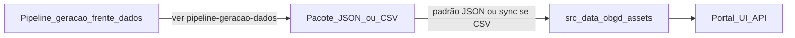

# Contrato de entrega de dados (plataforma)

| Metadado | Valor |
| --- | --- |
| **Audiência** | Engenharia · Operação · Frente de dados |
| **Status** | Canônico |
| **Última atualização** | 2026-09-13 |
| **Relacionados** | [Pipeline no portal](pipeline-obgd.md) · [Pipeline de geração](pipeline-geracao-dados.md) · [Escopos e schema](escopos-e-schema.md) · [Deploy](../05-operacao/deploy-e-hospedagem.md) · [Índice](../README.md) |

Define o **formato que a plataforma espera** para o snapshot estático do índice OBGD. A geração a partir das fontes brutas permanece na frente de dados — ver [Pipeline de geração de dados](pipeline-geracao-dados.md).

---

## 1. Papéis

| Papel | Responsabilidade |
| --- | --- |
| Frente de dados | Produzir o pacote de entrega alinhado a este contrato (**padrão: JSON**) |
| Engenharia do portal | Incorporar o pacote em `src/data/obgd/assets/`, validar, commit e redeploy |

A aplicação **não** coleta dados primários nem recalcula o índice bruto no runtime. Consome o subset JSON versionado em `src/data/obgd/assets/`.



---

## 2. Formato da entrega: padrão e alternativa

| Modalidade | Quando usar | O que a engenharia faz |
| --- | --- | --- |
| **JSON (padrão)** | Entrega habitual da frente de dados | Atualizar `src/data/obgd/assets/` com os arquivos JSON do inventário (seção 3); validar; commit; redeploy |
| **CSV (alternativa)** | Quando a frente de dados enviar o pacote flat em CSV | Colocar o pacote em `src/data/obgd/assets-v4/` e rodar o script de sync (seção 5) |

Detalhe operacional dos dois fluxos: [Pipeline OBGD](pipeline-obgd.md).

---

## 3. Inventário que a plataforma consome (JSON)

O app lê exclusivamente o subset em [`src/data/obgd/assets/`](../../src/data/obgd/assets/). Na entrega **padrão em JSON**, o pacote deve cobrir (com os mesmos nomes e shapes) os arquivos abaixo:

```
src/data/obgd/assets/
├── indice_long_por_objetivo.json
├── detalhes_nacional.json
├── detalhes_estadual.json
├── detalhes_municipios.json
├── variaveis-por-objetivo-nivel.json
└── dados/
    ├── ente.json
    ├── fonte.json
    ├── indicador.json          # tags[] + audiencia + status
    ├── objetivo_engd.json
    ├── tag.json
    └── indice_por_tag.json
```

| Arquivo | Papel |
| --- | --- |
| `indice_long_por_objetivo.json` | Ranking, radar, notas por objetivo |
| `detalhes_*.json` | Lista de variáveis no drill-down e export |
| `variaveis-por-objetivo-nivel.json` | Disclaimer de contagem no ranking |
| `dados/ente.json` | Entes (sem recorte `capital` na UI) |
| `dados/fonte.json` / `indicador.json` / `objetivo_engd.json` / `tag.json` | Catálogos |
| `dados/indice_por_tag.json` | Scores do modo temáticas |

### Não incluir no subset versionado do app

| Artefato | Motivo |
| --- | --- |
| `indicador_valor.json` | Volume alto; não entra no bundle do client |
| `detalhes_capitais.json` | Recorte Capitais removido da UI |

Schema relacional de referência (modelo completo da frente de dados): [`src/data/obgd/assets-v4/dados/SCHEMA.md`](../../src/data/obgd/assets-v4/dados/SCHEMA.md). Resumo: [Escopos e schema](escopos-e-schema.md).

### Avisos de produto / schema

1. `indice_geral` / média geral são **provisórios** no pacote e **não** devem ser expostos na UI.
2. Escalas de `sub_indice`, `indice_geral` e `valor_normalizado`: **0–100**.
3. Snapshot: cada fonte contribui com o ano mais recente usado no índice (edição de referência do app: **2026**).
4. Na UI, o rótulo da nota por objetivo é **Índice** (campo nos dados: `sub_indice`).

---

## 4. Escopos e níveis

| Nos dados (`nivel` / `ente.tipo`) | Na UI (`NivelKey`) | Observação |
| --- | --- | --- |
| `nacional` | `federal` | Brasil |
| `uf` | `estadual` | 27 UFs |
| `municipio` | `municipios` | 319 ≥ 100 mil hab. (inclui capitais como município) |
| `capital` | — | Se vier na entrega, **não** entra no recorte da UI |

URLs antigas `/municipal` redirecionam para `/municipios`.

---

## 5. Alternativa: entrega em CSV

Quando o pacote vier em **CSV** (views flat + pasta `dados/` em JSON), a engenharia usa a pasta `src/data/obgd/assets-v4/` e o script:

```bash
node --max-old-space-size=4096 scripts/sync-obgd-assets-from-v4.mjs
```

### Arquivos exigidos pelo sync

**CSVs na raiz**

| Arquivo | Uso no sync |
| --- | --- |
| `indice_long_por_objetivo.csv` | → `indice_long_por_objetivo.json` (filtra `nivel === capital`) |
| `detalhes_nacional.csv` | → `detalhes_nacional.json` |
| `detalhes_estadual.csv` | → `detalhes_estadual.json` |
| `detalhes_municipios.csv` | → `detalhes_municipios.json` |

Colunas mínimas do long: `nivel`, `unidade`, `unidade_nome`, `objetivo`, `objetivo_nome`, `ano_indice`, `sub_indice`, `indice_geral`, `n_objetivos_com_dados`, `posicao_no_objetivo`.

Colunas mínimas de `detalhes_*`: `categoria`, `objetivo`, `objetivo_nome`, `concept_id`, `fonte`, `indicador`, `sub_itens`, `descricao`, `escala`, `populacao`, `valor_normalizado`, `ano_fonte`.

**JSON em `dados/` (ainda necessários no pacote CSV)**

| Arquivo | Uso no sync |
| --- | --- |
| `ente.json` | Copiado com filtro `tipo !== capital` |
| `fonte.json` | Cópia direta |
| `indicador.json` | Cópia direta |
| `objetivo_engd.json` | Cópia direta |
| `tag.json` | Cópia direta |
| `indicador_valor.json` | Lido só para gerar `indice_por_tag.json`; **não** versionado em `assets/` |

Tratamentos do sync: `ano_indice` vazio → `2026`; `n_objetivos_com_dados` vazio em município → `7`; geração de `variaveis-por-objetivo-nivel.json`.

---

## 6. Campos críticos

| Campo | Expectativa |
| --- | --- |
| `sub_indice` | Nota 0–100 por ente × objetivo; na UI o rótulo é **Índice** |
| `valor_normalizado` | 0–100 por indicador no painel de detalhes |
| `ano_indice` | Preferencialmente preenchido; se vazio no CSV, o sync grava **2026** |
| `n_objetivos_com_dados` | Se vazio em município no CSV, fallback **7** no sync |
| `indice_geral` | Pode existir no pacote; **proibido** como ranking/média na UI |
| `indicador.tags` | Array de ids presentes em `tag.json` |
| `indicador.status` | Apenas `ativo` entra no score por tag |
| `concept_id` | Chave do indicador nos detalhes (export / disclaimer) |

---

## 7. Como a operação atualiza a plataforma

1. Receber o pacote (JSON padrão ou CSV).
2. Seguir o fluxo correspondente em [Pipeline OBGD — como atualizar](pipeline-obgd.md).
3. Commitar `src/data/obgd/assets/`.
4. Redeploy — [Deploy e hospedagem](../05-operacao/deploy-e-hospedagem.md) §10.

Links oficiais das fontes (URLs da edição) e CSV curado **para download no portal**: [Fontes e exportação](fontes-e-exportacao.md) — atualizar `fonte-urls.ts` quando a frente de dados informar novos endereços.

---

## 8. Pipeline de geração (frente de dados)

A construção do pacote a partir das fontes oficiais (TIC, IBGE, etc.) **não** é documentada neste arquivo.

Documentação reservada: [`pipeline-geracao-dados.md`](pipeline-geracao-dados.md) — a ser preenchida pela frente de dados. Enquanto estiver pendente, este contrato permanece a especificação do **output** esperado pela plataforma.
