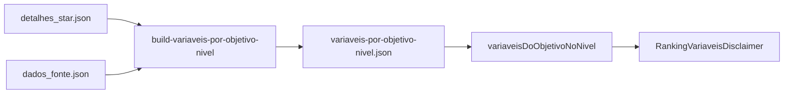

# Disclaimer de variáveis no ranking

| Metadado | Valor |
| --- | --- |
| **Audiência** | Engenharia |
| **Status** | Canônico |
| **Última atualização** | 2026-09-13 |
| **Relacionados** | [Pipeline OBGD](pipeline-obgd.md) · [Indicadores e ranking](../04-features/indicadores-e-ranking.md) · [Índice](../README.md) |

---

## 1. Visão geral

No ranking ordenado por objetivo, a plataforma informa **quantas variáveis** entram no Índice daquele **nível × objetivo** e permite listá-las sem sair da página.

| Aspecto | Decisão |
| --- | --- |
| Escopo da UI | Modo `por=objetivos` em `/ranking` (estadual e municípios) |
| Contagem | Painel de `detalhes_*` do nível — **não** o catálogo global |
| Lista | Modal Dialog shadcn (`Ver quais são`) com nome + fonte |
| Bundle | JSON pré-agregado leve no client |
| Fora de escopo | Modo `por=tematicas`; link para `/objetivos/{slug}` como contagem |

**Motivo:** o mesmo objetivo ENGD pode ter dezenas de indicadores no painel nacional e poucos no estadual/municipal. Contar pelo catálogo global desinforma o leitor do ranking subnacional.

Exemplo (Objetivo 1 — Governança): federal **29**, estadual **1**, municípios **1** (snapshot de referência).

---

## 2. Comportamento na UI

1. Seleção de nível (estadual / municípios) e objetivo ENGD.
2. Texto: *Neste nível, este índice usa **N** variável(is).* + link **Ver quais são**.
3. Modal com nome legível (`descricao`) e nome da fonte.
4. Se `N = 0`, o bloco **não** é renderizado.

| Arquivo | Papel |
| --- | --- |
| `src/components/ranking/ranking-explorer.tsx` | Monta o disclaimer no modo objetivos |
| `src/components/ranking/ranking-variaveis-disclaimer.tsx` | Copy + Dialog |
| `src/data/obgd/variaveis-por-objetivo-nivel.ts` | `variaveisDoObjetivoNoNivel(nivel, objetivoNumero)` |

---

## 3. Origem dos dados

| Nível UI | Arquivo de detalhes |
| --- | --- |
| `federal` | `detalhes_nacional.json` |
| `estadual` | `detalhes_estadual.json` |
| `municipios` | `detalhes_municipios.json` |

Asset pré-agregado: `src/data/obgd/assets/variaveis-por-objetivo-nivel.json`.

Cada item: `id` (`concept_id`), `nome` (`descricao`), `fonte` (nome em `fonte.json`).

---

## 4. Geração do asset

```bash
node scripts/build-variaveis-por-objetivo-nivel.mjs
```

Também é disparado ao final de `scripts/sync-obgd-assets-from-v4.mjs`.



---

## 5. O que não fazer

- Não usar `indicadoresDoObjetivo` / `/objetivos/[slug]` como contagem do ranking estadual ou municipal.
- Não importar `detalhes_*.json` no client do ranking.
- Não exibir disclaimer com `N = 0`.
