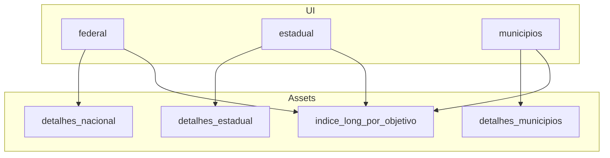
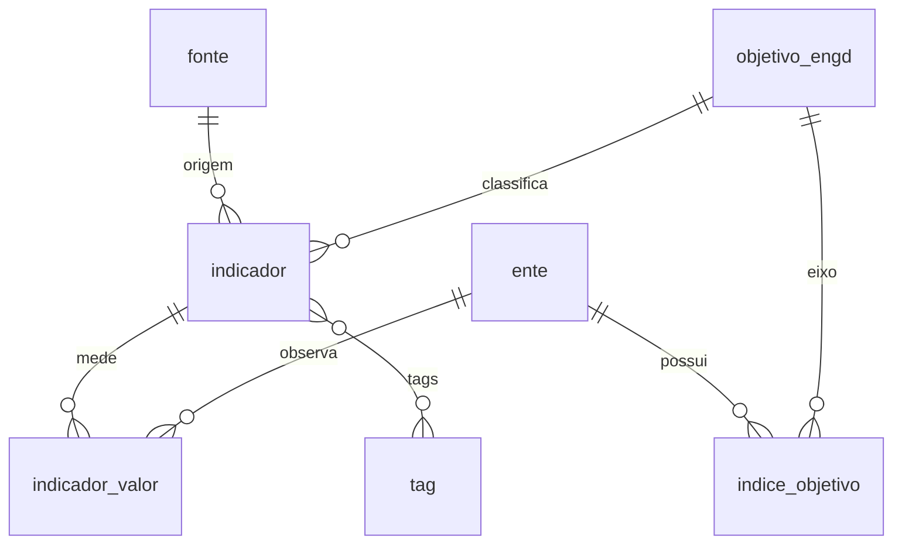

# Escopos e schema

| Metadado | Valor |
| --- | --- |
| **Audiência** | Engenharia |
| **Status** | Canônico |
| **Última atualização** | 2026-09-13 |
| **Relacionados** | [Contrato de entrega](contrato-entrega-dados.md) · [Pipeline OBGD](pipeline-obgd.md) · [Glossário](../01-produto/glossario.md) · [Índice](../README.md) |

---

## 1. Recortes na UI × dados

| Recorte na UI (`NivelKey`) | Rótulo | `indice_long.nivel` / detalhes | Entes |
| --- | --- | --- | --- |
| `federal` | Federal | `nacional` | Brasil |
| `estadual` | Estadual | `uf` | 27 UFs |
| `municipios` | Municípios | `municipio` | 319 ≥ 100 mil hab. (inclui capitais) |

O sync **filtra** linhas `capital` da entrega bruta. URLs antigas `/municipal/...` redirecionam para `/municipios/...`.

---

## 2. Modelo relacional (entrega)

A entrega completa (ex.: `assets-v4/dados/`) segue um modelo entidade-relacionamento. Documentação detalhada: [`src/data/obgd/assets-v4/dados/SCHEMA.md`](../../src/data/obgd/assets-v4/dados/SCHEMA.md) (quando a pasta estiver presente).

Entidades principais:

| Entidade | Papel |
| --- | --- |
| `fonte` | Pesquisa / base de origem |
| `objetivo_engd` | 10 objetivos (ids 1–10) |
| `ente` | Brasil, UF ou município |
| `indicador` | Variável (inclui `tags[]`, `audiencia`) |
| `indicador_valor` | Valor por ente (não versionado no subset do app) |
| `indice_objetivo` | Nota por ente × objetivo |
| `tag` | 16 temas transversais |
| `dimensao_conceitual` / `dimensao_tematica` | Organização metodológica (≠ tags da UI) |

**Aviso:** `indice_geral` / média geral são **provisórios** no schema e **não** devem ser expostos na UI. Escalas de `sub_indice`, `indice_geral` e `valor_normalizado`: 0–100.

### Relacionamentos (FKs resumidos)

---

## 3. Views flat usadas pelo app

| Arquivo | Uso |
| --- | --- |
| `indice_long_por_objetivo.json` | Ranking, radar, scores por objetivo |
| `detalhes_*.json` | Lista de variáveis no drill-down e export CSV |
| `dados/tag.json` + `indice_por_tag.json` | Modo temáticas |
| `variaveis-por-objetivo-nivel.json` | Disclaimer de contagem no ranking |

Dentro de um nível, os entes compartilham o mesmo conjunto de `concept_id`; apenas o `valor_normalizado` muda.

---

## 4. Campos frequentes em `detalhes_*`

Incluem, entre outros: `objetivo`, `objetivo_nome`, `fonte`, `indicador`, `concept_id`, `descricao`, `escala`, `populacao`, `valor_normalizado`, `ano_fonte`, unidade/categoria do ente.

O campo de nota por objetivo no long permanece `sub_indice` no schema; o rótulo na UI é **Índice**.
