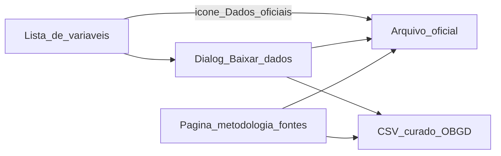
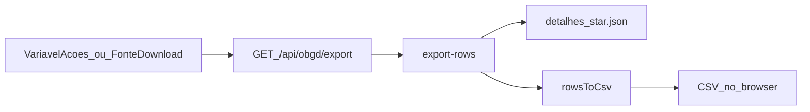

# Fontes oficiais e exportação CSV

| Metadado | Valor |
| --- | --- |
| **Audiência** | Engenharia |
| **Status** | Canônico |
| **Última atualização** | 2026-09-13 |
| **Relacionados** | [Pipeline OBGD](pipeline-obgd.md) · [Disclaimer de variáveis](disclaimer-variaveis.md) · [Índice](../README.md) |

A plataforma **não hospeda** microdados brutos. Oferece dois canais distintos de acesso a dados.

| Canal | Onde | Conteúdo |
| --- | --- | --- |
| **CSV do OBGD** | `GET /api/obgd/export` | Recorte normalizado (0–100) do snapshot usado no índice |
| **Link oficial** | catálogo `FONTES_ACESSO` | Arquivo da edição usada no índice (zip, xlsx, PDF ou API) |



---

## 1. CSV curado do OBGD

### Visão geral

| Aspecto | Decisão |
| --- | --- |
| Geração | Server-side (Route Handler) |
| Origem | `detalhes_{nacional,estadual,municipios}.json` |
| Formato | UTF-8 + BOM, separador `,`, Excel-friendly |
| Schema | Colunas fixas (sem seletor na UI) |



### Arquivos-chave

| Papel | Caminho |
| --- | --- |
| Rota API | `src/app/api/obgd/export/route.ts` |
| Filtro / mapeamento | `src/data/obgd/export-rows.ts` |
| Serializer | `src/lib/export-obgd-csv.ts` |
| UI variável | `src/components/shared/variavel-acoes.tsx` |
| UI fonte | `src/components/metodologia/obgd-fonte-download-button.tsx` |

### Modos de export

| Query | Escopo | Exemplo |
| --- | --- | --- |
| `nivel` + `conceptId` (+ `subItens` opcional) | Indicador em todas as unidades do nível | `/api/obgd/export?nivel=estadual&conceptId=tic_gov/B1` |
| `fonteId` | Indicadores de uma pesquisa OBGD, nos níveis cobertos | `/api/obgd/export?fonteId=munic` |
| `metodologiaSlug` (legado) | Agregado por órgão (várias pesquisas) | `/api/obgd/export?metodologiaSlug=cetic-br` |

Erros comuns: `400` parâmetros inválidos; `404` sem linhas ou fonte sem mapeamento.

### Schema do CSV

Colunas (ordem fixa):

`nivel`, `unidade`, `unidade_nome`, `objetivo`, `objetivo_nome`, `concept_id`, `fonte_id`, `fonte_nome`, `indicador`, `sub_itens`, `descricao`, `escala`, `populacao`, `valor_normalizado`, `ano_fonte`, `ano_indice`

### Nomenclatura dos arquivos

| Modo | Padrão | Exemplo |
| --- | --- | --- |
| Por conceito | `obgd-{nivel}-{slug-concept}.csv` | `obgd-estadual-tic-gov-b1.csv` |
| Por fonte | `obgd-fonte-{slug-id}.csv` | `obgd-fonte-tic-gov.csv` |

### Status

Implementação (API + UI + serializer) concluída. Validação formal do schema com a frente de dados permanece pendente.

---

## 2. Links oficiais das fontes

### Modelo

Tudo vive em [`src/data/obgd/fonte-urls.ts`](../../src/data/obgd/fonte-urls.ts). Não duplicar URLs em outro arquivo.

```ts
type FonteAcessoTipo = 'download_livre' | 'solicitacao' | 'painel'

type FonteArquivo = { label: string; url: string; tipo: FonteAcessoTipo }

type FonteAcesso = {
  urlPesquisa: string
  arquivos: FonteArquivo[]
}
```

| Campo | Uso |
| --- | --- |
| `urlPesquisa` | Landing da pesquisa (CTA secundário) |
| `arquivos[]` | Downloads da **edição usada no índice** |
| `tipo` | `download_livre` · `painel` · `solicitacao` |

Helpers: `arquivosDaFonte`, `acessoDaFonte`, `urlFontePrimaria`, alias `FONTE_URLS`.

O site do órgão (`urlOrgao`) fica em `src/data/fontes.ts` (`ORGAO_URL_POR_INSTITUICAO`), fora deste catálogo.

### Onde aparece na UI

| Superfície | Comportamento |
| --- | --- |
| Lista de variáveis (`VariavelAcoes`) | Ícone externo → arquivo primário; diálogo com CSV OBGD **e** lista oficial |
| Página `/metodologia/fontes/[fonte]` | Bloco de downloads oficiais + CSV OBGD se houver export |

### Catálogo desta edição (resumo)

IDs = `fonte.id` em `fonte.json`. URLs canônicas só em `FONTES_ACESSO`.

| `fonteId` | Edição | Observação |
| --- | ---: | --- |
| `tic_gov` | 2023 | Zips ODS (órgãos e prefeituras) |
| `tic_saude` / `tic_educacao` / `tic_cultura` / `tic_domicilios` | 2024 | Zips ODS CETIC |
| `iesgo` | 2024 | Sem arquivo; só `urlPesquisa` (TCU) até URL de download |
| `iospd` | 2025 | xlsx + PDF |
| `anatel` | 2025 | Zips banda larga / cobertura |
| `censo_escolar` | 2024 | Zip INEP |
| `pnad_tic` | 2024 | Zip + sintaxe |
| `sgd_sat` | 2025 | API (`painel`) |
| `munic` / `estadic` | 2024 | xlsx FTP IBGE |
| `igovsisp` | 2025 | PDF autodiagnóstico |

CETIC: rotular como “Tabelas ODS”, não como microdados unitários (Termo NIC.br).

### Como atualizar (edição seguinte)

1. Obter da frente de dados, por fonte: `fonteId`, ano, URL, `tipo`.
2. Editar só `fonte-urls.ts`.
3. Ajustar `label` com o ano da edição.
4. Sem arquivo: `arquivos: []` + `urlPesquisa` útil.
5. Não commitar cópia das bases oficiais no repositório.
