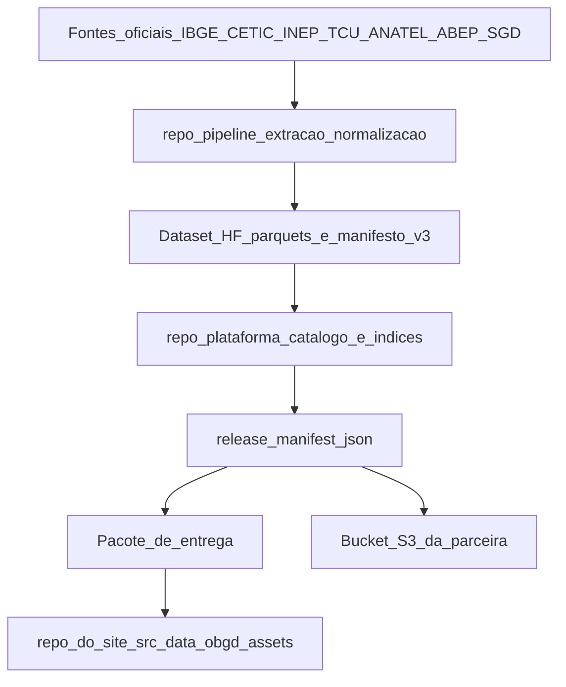

# Pipeline de geração de dados

| Metadado | Valor |
| --- | --- |
| **Audiência** | Frente de dados · Engenharia · Operação |
| **Status** | Vivo, mantido pela frente de dados |
| **Última atualização** | 2026-09-20 |
| **Relacionados** | [Contrato de entrega](contrato-entrega-dados.md) · [Pipeline no portal](pipeline-obgd.md) · [Escopos e schema](escopos-e-schema.md) · [Fontes e exportação](fontes-e-exportacao.md) · [Índice](../README.md) |

Descreve como o snapshot do Índice OBGD é produzido, das fontes oficiais até o pacote que a plataforma consome.

**Este documento não é definitivo e não deve ser tratado como tal.** A pipeline está em evolução; este arquivo é atualizado junto com o código. A seção 10 registra o que está aberto.

**Fronteiras.** O formato esperado pelo portal é definido pelo [Contrato de entrega de dados](contrato-entrega-dados.md). Este documento cobre a geração até o pacote validado. A incorporação desse pacote ao portal está documentada em [Pipeline OBGD](pipeline-obgd.md).

---

## 1. Onde o código vive

A geração acontece em dois repositórios da organização, separados de propósito:

| Repositório | Responsabilidade | O que **não** faz |
| --- | --- | --- |
| `obsgovdigital/pipeline` | Baixar fontes oficiais, extrair, normalizar para 0–100, publicar parquets | Não classifica variável por objetivo da ENGD nem decide status editorial |
| `obsgovdigital/plataforma` | Catálogo editorial, classificação, cálculo dos índices, relatório, pacote de entrega | Não baixa fonte bruta nem importa código do `pipeline` |

A separação é recíproca e está escrita nos dois repositórios. Ela existe porque são dois tipos de decisão: o `pipeline` responde "qual é o valor medido"; a `plataforma` responde "o que esse valor significa no índice". Misturar as duas tornaria impossível auditar uma sem a outra.

A comunicação entre eles é unidirecional, por um dataset no Hugging Face, nunca por import de código.



---

## 2. Abordagem: snapshot, não série temporal

Cada fonte contribui com **exatamente um ano**, a edição mais recente disponível. Não há série histórica, nem preenchimento de lacunas, nem modo comparável entre anos.

Isso é uma decisão metodológica, não uma limitação temporária de implementação. Consequência prática: **virar o ano do índice não é reprocessar, é trabalho de código.** Há anos fixados em vários pontos, e cada fonte muda de layout entre edições.

---

## 3. As fontes

Treze fontes compõem o snapshot corrente. Os links apontam para o arquivo da edição usada no índice, conferidos em setembro de 2026.

| Fonte | Instituição | Edição | Obtenção |
| --- | --- | --- | --- |
| TIC Governo Eletrônico | CETIC.br | 2023 | Automática (scraping do portal de arquivos) |
| TIC Saúde | CETIC.br | 2024 | Automática |
| TIC Educação | CETIC.br | 2024 | Automática |
| TIC Cultura | CETIC.br | 2024 | Automática |
| TIC Domicílios | CETIC.br | 2024 | Automática |
| iESGo | TCU | 2024 | Automática (URL canônica com 2 fallbacks) |
| IOSPD | ABEP-TIC | 2025 | **Manual**, sem downloader; validado por script |
| Cobertura Móvel | ANATEL | 2025 | Automática (ZIP de dados abertos) |
| Censo Escolar | INEP | 2024 | Automática (URL previsível por ano) |
| PNAD Contínua TIC | IBGE | 2024 | Automática (listagem do FTP) |
| MUNIC | IBGE | 2024 | Automática (listagem do FTP) |
| ESTADIC | IBGE | 2024 | Automática (listagem do FTP) |
| iGovSISP | SGD/MGI | 2025 | **Híbrida**: o PDF baixa; os valores vêm de transcrição |

Os endereços usados na coleta são declarados nos módulos de `baixadores/` e nas configurações de cada fonte no repositório `pipeline`. Os links apresentados ao usuário pelo portal ficam no catálogo [`src/data/obgd/fonte-urls.ts`](../../src/data/obgd/fonte-urls.ts), descrito em [Fontes e exportação](fontes-e-exportacao.md).

### Duas advertências sobre os links

**Os três PDFs do gov.br retornam 403 sem User-Agent de navegador.** Funcionam no clique do usuário, mas quebram em fetch server-side, proxy ou cache com User-Agent padrão.

**Os arquivos do CETIC não têm URL construível.** Ficam em `cetic.br/media/microdados/<id>/`, onde `<id>` é um identificador interno do CMS que não se deriva do ano nem da pesquisa. Por isso o downloader raspa a página de arquivos em vez de montar o endereço.

### O que ficou de fora, e por quê

Não entram no índice: sub-índices compósitos já calculados pela própria fonte (o que barrou EGDI/ONU, GTMI/Banco Mundial e DGI/OCDE, além do iGovTI); pesquisas sem variável de governo digital; e pesquisas cuja produção foi interrompida. O detalhamento está no capítulo 3 do relatório metodológico.

A satisfação Gov.br (`sgd_sat`) foi **retirada** do snapshot ativo. O módulo legado permanece no repositório, marcado explicitamente como fora do snapshot. O indicador BLF02 da ANATEL também não é emitido na edição atual, por não existir denominador oficial versionado para 2025.

---

## 4. Etapa 1: Coleta

Os downloaders vivem em `baixadores/` no repositório `pipeline`. O padrão compartilhado por `baixadores/base.py` é:

1. **Idempotência**: se o arquivo já existe no destino, pula (salvo `--force`).
2. **Download em streaming** para `fontes/.staging/`.
3. **Validação específica do formato**: abas obrigatórias no XLSX, colunas e contagem mínima de linhas no CSV, integridade do ZIP, magic bytes e tamanho mínimo no PDF.
4. **Movimento após validação** para `fontes/`, por `shutil.move`.

O downloader do CETIC é uma exceção: ele extrai os arquivos diretamente no diretório final e não usa o staging comum. Essa diferença precisa ser considerada ao diagnosticar uma coleta interrompida.

Todos os comandos desta seção partem da raiz do repositório `pipeline`. Num ambiente novo:

```bash
cd pipeline
uv sync
```

Rodar tudo:

```bash
uv run python -m baixadores.baixar_todos
```

Num clone novo, esse é o caminho canônico para popular `fontes/`. Se já existe uma cópia local dos microdados brutos, há a alternativa de apontar a raiz e materializar os symlinks:

```bash
OBSGOV_MICRODADOS=/caminho/para/microdados uv run python preparar_fontes.py
uv run python preparar_fontes.py --check   # diagnostica qual fonte externa falta
```

### Código de saída e logs da coleta

O orquestrador retorna código diferente de zero quando **qualquer** subprocesso termina com falha. Seis dos sete downloaders orquestrados propagam corretamente a falha; a exceção é o downloader do CETIC, que relata edições malsucedidas no log sem encerrar com código de erro. A automação deve verificar o código de saída e também o resumo do CETIC.

### Fontes que exigem trabalho humano

| Fonte | O que é manual |
| --- | --- |
| IOSPD (ABEP) | Baixar o XLSX do portal e rodar `uv run python -m baixadores.validar_iospd --arquivo <caminho>`, que valida, remove linhas de teste e posiciona o arquivo |
| iGovSISP (SGD/MGI) | A fonte publica relatórios agregados em PDF, sem microdados públicos. A implementação corrente depende de transcrição conferida em `fontes/sgd-govbr/igovsisp/dados/igovsisp_variaveis.csv`, arquivo consumido pelo extrator. O repositório não contém um conversor reproduzível do PDF para esse CSV |

---

## 5. Etapa 2: Extração e normalização

Cada extrator em `extratores/` lê o arquivo bruto de sua fonte e escreve um parquet em `dados/{fonte}_{ano}.parquet`.

```bash
uv run python extrair_todos.py              # todos
uv run python -m extratores.tic_saude       # um só
```

O orquestrador verifica os insumos externos, roda os extratores na ordem registrada, **detecta extrator que roda sem atualizar o parquet** (falha silenciosa), valida o conjunto exato de parquets esperado e fecha o manifesto.

### O contrato de saída: 14 colunas

`fonte`, `indicador`, `sub_item`, `dimensao`, `categoria`, `ano`, `valor`, `escala`, `tipo_escala`, `valor_normalizado`, `populacao`, `source_item_id`, `concept_item_id`, `concept_id`.

As três últimas são a **linhagem**, e são o que torna o dado auditável:

| Coluna | Identifica |
| --- | --- |
| `source_item_id` | O item físico daquela edição da fonte |
| `concept_item_id` | Liga itens equivalentes entre edições e populações |
| `concept_id` | A chave editorial; **é por ela que a plataforma seleciona** |

`indicador` e `sub_item` continuam presentes como coordenadas legadas e metadados auditáveis, mas não substituem os IDs.

### Normalização

Toda fonte é convertida para uma escala comum 0–100, com clamp obrigatório nos extremos:

| Escala de origem | Conversão |
| --- | --- |
| `prop_0_100` | Identidade, proporção já em 0–100 |
| `indice_0_100` | Identidade |
| `indice_0_10` | `valor × 10` |
| `escala_1_5` | `(valor − 1) × 25` |
| `pct_meta_100` | Identidade, a meta é 100 |
| `binario_agregar` | Identidade, já agregado a percentual pelo extrator |
| `contagem_absoluta` | **Não normalizada**: contagem física, fora da composição do índice |

### O manifesto v3

Depois de todos os extratores, o orquestrador reconstrói `dados/manifest.json`. Ele lista cada parquet com SHA-256 e número de linhas, e registra, por `source_item_id`, o arquivo de origem e seu hash, a aba, os códigos oficiais, o rótulo, a escala e a derivação.

O manifesto distingue dois tipos de operando: os que pertencem ao arquivo bruto (colunas, intervalos de planilha, chaves geográficas) e as dependências entre itens físicos já publicados. Só o segundo tipo tem integridade referencial: cada ID precisa existir no mesmo manifesto, não pode apontar para si mesmo, e o grafo inteiro precisa ser acíclico.

Item direto exige fórmula nula e nenhum operando; valor agregado ou derivado exige fórmula e ao menos um operando. Coordenadas CETIC e coordenadas derivadas exigem contrato explícito. Coordenadas físicas com códigos oficiais estáveis podem usar o contrato canônico construído pelo pipeline. Não há caminho silencioso para um número sem procedência.

### Publicação do snapshot no Hugging Face

Depois de conferir os parquets e o manifesto, a publicação exige credencial de escrita, a revisão remota auditada e o hash do manifesto aprovado:

```bash
hf auth login
uv run python publicar_hf.py \
  --repo-id <organizacao/dataset> \
  --expected-parent-sha <sha-remoto-auditado> \
  --expected-manifest-sha256 <sha256-do-manifesto> \
  --tag <tag-da-release>
```

Se a publicação remover um artefato remoto obsoleto, cada caminho precisa ser autorizado explicitamente com `--allow-delete`. A tag ou o SHA publicado deve ser fixado na plataforma por `HF_DATASET_REVISION` antes do build da release.

---

## 6. Etapa 3: O catálogo de variáveis

Esta é a peça central da metodologia, e a que menos se reconstrói sozinha. Vive em `variaveis/catalogo_variaveis.py`, no repositório `plataforma`: 490 entradas, das quais 327 ativas, 162 excluídas e 1 saturada.

### Por que existe

**Porque o índice é uma média.** Cada objetivo da ENGD recebe a média das variáveis classificadas nele. Sem uma declaração única e versionada de qual objetivo, qual escala, qual população, qual agrupamento e qual status cada variável tem, o número final não é auditável nem reproduzível.

**Porque os parquets carregam valor, não juízo.** Um parquet diz que 62,3% dos órgãos têm política de segurança. Ele não diz se isso pertence ao Objetivo 4, se a variável está ativa, ou se conta junto com outra. Essa camada de interpretação é o catálogo.

**Porque o eixo é normativo.** Os dez objetivos vêm do **Decreto 12.069/2024, art. 9º**; nenhuma portaria cria, suprime ou renumera objetivo. Já a *redação* citada no relatório vem da **Portaria SGD/MGI 5.395/2026**, e as duas divergem de fato: o decreto acrescenta menções que a portaria condensa e reescreve o Objetivo 7 de forma substantiva. A escolha está registrada em `metodologia/hierarquia_fontes_engd.md`, e o texto canônico é conferido contra uma transcrição do Diário Oficial, a única peça do repositório que não foi redigida internamente, existindo para responder à pergunta que nenhuma comparação interna responde: *o texto publicado ainda é o texto da norma?*

### Como uma entrada é formada

A chave é `fonte/indicador`, ou `fonte/indicador_sub` quando o mesmo indicador entra em objetivos distintos com sub-itens diferentes. Cada entrada declara fonte, código na origem, sub-itens, descrição, enunciado da pergunta, escala, população, objetivos da ENGD, tags, bateria, regra de agregação, status, motivo e processo de exclusão, anos observados e primeiro ano.

Os vocabulários são fechados em `variaveis/esquema_catalogo.py`, derivados uma única vez de aliases de tipo e validados no próprio import do catálogo, com verificação estática no CI. Um valor digitado errado não chega a ser gravado.

### Os eixos de classificação

| Eixo | Cardinalidade | Onde vive |
| --- | --- | --- |
| Objetivo da ENGD (1–10) | Exatamente 1 por variável | Campo no catálogo |
| Dimensão conceitual (3) | Exatamente 1 | Campo no catálogo, atribuído por classificador com overrides justificados |
| Dimensão temática (54) | Exatamente 1 | Registro `dimensoes_por_objetivo.py`; não é campo da variável |
| Recorte federativo | Criado só com ≥2 variáveis ativas de fontes habilitadas para o recorte | Registro, com decisão explícita por fonte |
| Tag transversal (17) | **Zero, uma ou várias** | Campo no catálogo, vocabulário em `tags.py` |

### Como uma variável recebe tag

As tags reagrupam temas que o eixo dos objetivos separa. Conectividade, por exemplo, aparece em infraestrutura, serviços e competências. A regra de admissão no vocabulário é restritiva: *uma tag só entra se reagrupar variáveis que os objetivos separam*; tema que devolve quase o mesmo conjunto de um objetivo não acrescenta forma de leitura.

O classificador acumula sinais em seis camadas, nesta ordem: curadoria manual, famílias de códigos da fonte, baterias homogêneas, expressões regulares sobre o enunciado, curadoria aditiva e, por último e mais fraco, fontes dedicadas a um só assunto. **Só a curadoria manual encerra a classificação**; as demais acumulam.

A ordem não é arbitrária, e a razão vale registrar porque é o modo de falha característico deste tipo de classificação. A camada de regex confundia **cláusula de universo com assunto medido**: enunciados como "órgãos *com acesso à Internet* que ofereceram X" delimitam quem responde, não o que se mede, e a regex via "Internet" e atribuía `conectividade`. Uma pergunta sobre política de privacidade saía marcada como conectividade em vez de segurança e LGPD.

Uma revisão assistida por modelo de linguagem, em agosto de 2026, mediu o tamanho do problema: das divergências classificadas por tipo, 88 eram erro de universo contra 55 de assunto. **A revisão não escreveu no catálogo.** Produziu sugestões estruturadas; a coordenação examinou, promoveu as decisões aceitas para mapas determinísticos e preservou as exceções humanas.

Consequência prática para quem opera: **a classificação é reproduzível sem credencial ou serviço externo**. Os artefatos daquela rodada são históricos, descrevem uma população anterior e não participam do build.

```bash
uv run python variaveis/classificar_tags.py             # regenera a conferência
uv run python variaveis/classificar_tags.py --aplicar   # também atualiza o catálogo
```

### Status e procedência da exclusão

Três estados: `ativo`, `excluido`, `saturado`. Este último é usado para variável cujo valor não varia entre entes, e que por isso não discrimina. O filtro padrão do cálculo é apenas `ativo`.

Toda variável excluída carrega o **processo editorial** que a excluiu, de um vocabulário fechado de seis lotes. O valor de cada um foi derivado **do commit que primeiro marcou a chave como excluída**, não do texto do motivo, que foi reescrito depois em parte das entradas e deixou de ser procedência confiável. A derivação corrente é reexecutável com `uv run python variaveis/aplicar_processo_exclusao.py --verificar`; o documento `metodologia/proveniencia-exclusoes-2026-08.md` registra a rodada histórica anterior e não contém as contagens atuais.

Distribuição atual das 162 exclusões:

| Processo | Variáveis |
| --- | ---: |
| Construção inicial do catálogo | 55 |
| Gate de qualidade (jul/2026) | 43 |
| Auditoria de redundância, rodada 2 | 41 |
| Revisão de identidade do iGovSISP (set/2026) | 14 |
| Auditoria de redundância, rodada 1 | 8 |
| Auditoria de conformidade do Anexo A | 1 |

Os oito critérios de exclusão de variável (detalhe técnico irrelevante, percepção não atribuível, fora do escopo da ENGD, redundância, metadado de pesquisa, tecnologia muito específica, política interna, e percentual condicionado a filtro com universo abaixo de 90%) estão no capítulo 3 do relatório, com a lista completa das excluídas no Anexo A.

### Duas regras que mudam o número final

**Bateria.** Itens da mesma pergunta-mãe contam **juntos como uma variável**: a média dos itens observados forma um subscore que entra com peso 1 no objetivo. Na composição editorial dos objetivos não há vetor adicional de pesos; cada componente entra com peso igual depois do colapso das baterias. Isso não elimina ponderações próprias das fontes durante a extração, como os pesos de critérios do IOSPD e os pesos amostrais da PNAD TIC. Sem a regra de bateria, uma pergunta com doze alternativas pesaria doze vezes mais que uma pergunta simples.

**Agregação de sub-itens.** Indicadores do tipo "marque todas" usam `max` ("ao menos uma", para capacidades) ou `mean` (amplitude de adoção). A escolha é editorial e está declarada por variável. Limitação assumida: ambos são calculados sobre proporções já agregadas pela fonte, não sobre microdados.

### Manutenção

Toda alteração no catálogo (classificação, status, inclusão, remoção, mudança de enunciado, escala ou população) exige entrada no `CHANGELOG.md` no mesmo PR. Código novo exige teste: o CI mede a cobertura das linhas alteradas e reprova abaixo de 90%.

---

## 7. Etapa 4: Cálculo dos índices

O build calcula **quatro recortes**, cada um em **dois agrupamentos** (por objetivo da ENGD e por tag):

Todos os comandos desta seção partem da raiz do repositório `plataforma`. Num ambiente novo, fixe a revisão publicada do dataset antes de executar o build completo:

```bash
cd plataforma
uv sync
export HF_DATASET_REVISION=<tag-ou-sha-publicado>
uv run python build.py
```

`OBS_SKIP_SYNC=1` só deve ser usado quando `dados_hf/` já estiver materializado e validado na revisão pretendida.

| Recorte | Unidades | Fontes | Variáveis | Objetivos cobertos |
| --- | --- | ---: | ---: | --- |
| Nacional | Brasil agregado | 11 | 327 | 10 de 10 |
| Estadual | 27 UFs | 2 | 76 | 7 de 10 |
| Capitais | 27 capitais | 3 | 65 | 4 de 10 |
| Municipal | Municípios ≥100 mil hab. |  |  | Produto de dados; não entra nos capítulos do relatório |

O escore de um objetivo é a **média dos componentes com dado**, depois do colapso das baterias. Publicam-se duas contagens: o número de componentes efetivamente ponderados e o número de itens brutos observados.

### Não existe nota geral

**Não há agregado acima do objetivo.** Média entre os dez objetivos, ranking geral e contagem de objetivos com dado deixaram de ser produzidos, por decisão de setembro de 2026: uma nota única somaria coisas que a metodologia trata como não somáveis.

A geração atual não emite `indice_geral`; o pacote publica `sub_indice`, `n` e `n_itens` por objetivo. O [Contrato de entrega](contrato-entrega-dados.md) ainda descreve `indice_geral` como provisório no pacote e precisa ser reconciliado com a geração antes do próximo sync.

A normalização não acontece aqui: o parquet já chega em 0–100. A plataforma apenas verifica a faixa.

### A release

O build roda quinze etapas sob trava, mantendo uma única revisão do dataset do início ao fim, e só publica o manifesto de integridade depois que todas terminam. O resultado é `entregas/release_manifest.json`, que funciona como o "commit" da build: registra a revisão do dataset, a revisão do código, e os hashes de cada insumo e de cada saída.

Os CSVs dos quatro recortes, os gráficos e o relatório formam **uma unidade de publicação**. Executar isoladamente um módulo que escreveria nesses caminhos falha antes da escrita e indica o comando correto. Análises exploratórias rodam à parte porque gravam fora da release.

---

## 8. Etapa 5: O pacote de entrega

O pacote que o portal consome é gerado por um passo **posterior ao build e separado dele**:

```bash
uv run python scripts/gerar_entrega_site.py --output-dir <destino>
```

O exportador valida o manifesto da release, confere os hashes das entradas e saídas e a revisão materializada, tudo sob travas de leitura. Build incompleto ou arquivo divergente impede a exportação.

A saída traz o modelo relacional em JSON (`dados/`), as views achatadas em CSV, uma cópia de auditoria e, escrito **por último**, um marcador de exportação completa. É por ele que se sabe que o diretório não é um pacote pela metade.

O pacote é validado contra [`contracts/frontend-data-contract.json`](https://github.com/obsgovdigital/plataforma/blob/main/contracts/frontend-data-contract.json), no repositório `plataforma`, que **fixa o commit exato do repositório do site** para o qual foi negociado. Há teste que quebra se o transformador do portal mudar sem renegociação. Gerar o pacote não autoriza, por si, entregá-lo ou publicá-lo.

O formato detalhado que o portal espera, incluindo arquivos e colunas obrigatórias, é definido pelo [Contrato de entrega de dados](contrato-entrega-dados.md).

---

## 9. Canais de entrega

O pacote vai para **três destinos**, com papéis distintos:

| Canal | O que recebe | Para quê |
| --- | --- | --- |
| Repositório do site | O subset JSON em `src/data/obgd/assets/` | É o que entra no build do portal |
| **Bucket S3 da parceira** | O inventário completo da release **mais os parquets do dataset** | Entrega institucional, auditoria e reprodução |
| Hugging Face | Os parquets e o manifesto v3 | Canal entre `pipeline` e `plataforma` |

### O bucket S3

Não basta o pacote estar no repositório do site: a infraestrutura da parceira é S3, e a entrega institucional acontece lá.

```bash
uv run python scripts/sync_s3.py --dry-run   # lista o que subiria
uv run python scripts/sync_s3.py
```

Duas propriedades importam. Primeira: **o script não varre diretórios**. A lista do que sobe vem dos dois manifestos, o da release e o do dataset, ambos validados sob trava mantida até o último upload. Não existe "subiu um arquivo que não era da release". Segunda: **os caminhos locais canônicos são preservados no destino**, de modo que o que está no bucket é reconhecível a partir do repositório.

Configuração: destino obrigatório em `OBGD_S3_OUTPUT`, no formato `s3://<bucket>/<prefixo>/`, com a data virando subpasta. Credenciais pela cadeia padrão do SDK, preferencialmente por variável de ambiente.

O identificador do release entregue é, hoje, a **data no prefixo** somada ao `release_manifest.json` que vai junto.

---

## 10. Limitações e pontos de atenção

Esta seção é para quem assumir a operação. Nada aqui é hipótese.

**O snapshot é estático por construção.** Virar o ano do índice exige trabalho de código, não reprocessamento. Há anos fixados em pontos do pipeline e cada fonte muda de layout entre edições.

**O downloader do CETIC exige conferência adicional.** O orquestrador retorna falha quando qualquer subprocesso falha, mas o downloader do CETIC registra edições malsucedidas no log sem propagar código de erro. Ver seção 4.

**Duas fontes dependem de trabalho humano.** IOSPD não tem downloader; iGovSISP usa uma transcrição conferida dos relatórios agregados porque a implementação corrente não dispõe de microdados públicos nem de conversor reproduzível para o CSV consumido pelo extrator.

**Os PDFs do gov.br bloqueiam User-Agent não-navegador.** Qualquer integração server-side com esses links precisa declarar um User-Agent de navegador.

**Uma fonte foi retirada do snapshot ativo.** A satisfação Gov.br não participa da geração corrente, embora o módulo legado permaneça no repositório explicitamente marcado como fora do snapshot.

**Há documentação obsoleta nos repositórios.** Em particular, o `README.md` do diretório de índices e o inventário de fontes em `variaveis/inventario.md`, que é de março de 2026 e não reflete o conjunto atual. Não usar como referência.

---

## 11. Como este documento é mantido

Vive neste repositório do portal, no caminho reservado `docs/03-dados/pipeline-geracao-dados.md`. A frente de dados deve atualizá-lo sempre que a geração mudar de forma observável pelo consumidor: mudança no conjunto de fontes, no contrato de colunas, nas regras de cálculo ou nos canais de entrega.

Mudança que altere o **formato** do pacote exige atualizar também o [Contrato de entrega](contrato-entrega-dados.md), renegociar o contrato executável no repositório `plataforma` e coordenar com a engenharia do portal **antes** do sync; um pacote fora do contrato é recusado na validação.

| Revisão | Data | Mudança |
| --- | --- | --- |
| 1.0 | 2026-09-20 | Primeira publicação; substitui o stub reservado |
