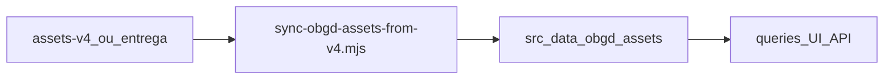

# Pipeline de dados OBGD

| Metadado | Valor |
| --- | --- |
| **Audiência** | Engenharia · Operação |
| **Status** | Canônico |
| **Última atualização** | 2026-09-13 |
| **Relacionados** | [Escopos e schema](escopos-e-schema.md) · [Fontes e exportação](fontes-e-exportacao.md) · [Índice](../README.md) |

---

## 1. Resumo

O app consome o subset versionado em [`src/data/obgd/assets/`](../../src/data/obgd/assets/), gerado a partir da entrega **assets-v4** (`src/data/obgd/assets-v4/`).

Edição de referência do índice no app: **2026** (`ANO_INDICE`).



---

## 2. Onde estão os dados?

| Pergunta | Resposta |
| --- | --- |
| Onde o app lê? | `src/data/obgd/assets/` — versionado no Git |
| Origem do sync atual | `src/data/obgd/assets-v4/` |
| Como atualizar? | `node --max-old-space-size=4096 scripts/sync-obgd-assets-from-v4.mjs` |
| Entregas brutas locais | `src/local_assets/` — **gitignored** |
| Script legado | `scripts/sync-obgd-assets-from-v3.mjs` (histórico) |

README curto dos assets: [`src/data/obgd/assets/README.md`](../../src/data/obgd/assets/README.md).

---

## 3. Inventário versionado (app)

```
src/data/obgd/assets/
├── indice_long_por_objetivo.json
├── detalhes_nacional.json
├── detalhes_estadual.json
├── detalhes_municipios.json
├── variaveis-por-objetivo-nivel.json
└── dados/
    ├── ente.json
    ├── fonte.json
    ├── indicador.json          # tags[] + audiencia
    ├── objetivo_engd.json
    ├── tag.json                # 16 tags
    └── indice_por_tag.json     # média por ente × tag
```

Não versionar `indicador_valor.json` (volume alto). Não emitir `detalhes_capitais.json` (recorte Capitais removido da UI).

---

## 4. O que o sync v4 faz

1. Converte CSVs flat → JSON (`ano_indice` vazio → `2026`; fallback de `n_objetivos_com_dados` nos municípios quando vazio).
2. Filtra `tipo` / `nivel` `capital` da entrega bruta.
3. Copia entidades canônicas (incl. `tag` e `indicador` com `tags` / `audiencia`).
4. Pré-calcula `indice_por_tag.json` agrupando por `(tipo, codigo, tag)`.
5. Dispara a geração de `variaveis-por-objetivo-nivel.json`.
6. **Não** copia `indicador_valor.json`.

### Por que pré-calcular `indice_por_tag`?

Embutir `indicador_valor` no bundle do client só para médias por tag é desnecessário. O score por tag é agregado offline; o front calcula o mínimo possível.

Fórmula:

```
para indicadores ativos com tag T
  join valores por indicador_chave
  agrupar por ente
  nota = média(valor_normalizado)   # 0–100, 1 casa decimal
```

Tags e objetivos ENGD são eixos **independentes**.

---

## 5. Camada de código

| Módulo | Papel |
| --- | --- |
| `src/data/obgd/types.ts` | Tipos (`TagRow`, `DetalheRow`, …) |
| `src/data/obgd/load.ts` | Importa assets; maps de tag e notas |
| `src/data/obgd/queries.ts` | Scores por objetivo filtrados por `ANO_INDICE` |
| `src/data/obgd/detalhes.ts` / `server.ts` | Drill-down |
| `src/data/tematicas/` | API pública das 16 tags para ranking/indicadores |

---

## 6. Catálogo oficial de tags (edição atual)

| id (slug) | Nome | Lado |
| --- | --- | --- |
| `conectividade` | Conectividade | cidadão |
| `canais-digitais-atendimento` | Canais digitais de atendimento | cidadão |
| `servicos-publicos-digitais` | Serviços públicos digitais | cidadão |
| `cidades-inteligentes` | Cidades inteligentes | cidadão |
| `pagamento-digital` | Pagamento digital | cidadão |
| `identidade-digital` | Identidade digital e autenticação | cidadão |
| `saude-digital` | Saúde digital | cidadão |
| `educacao-digital` | Educação digital | cidadão |
| `transparencia-dados-abertos` | Transparência e dados abertos | cidadão |
| `inclusao-acessibilidade` | Inclusão e acessibilidade | cidadão |
| `gestao-planejamento-ti` | Gestão e planejamento de TI | gestor |
| `servicos-digitais` | Sistemas e serviços digitais | gestor |
| `dados-interoperabilidade` | Dados e interoperabilidade | gestor |
| `seguranca-lgpd` | Segurança e LGPD | gestor |
| `contratacoes` | Contratações e compras | gestor |
| `infraestrutura` | Infraestrutura e plataformas | gestor |

Fonte canônica: `dados/tag.json`.

---

## 7. Operação: nova entrega

1. Atualizar `src/data/obgd/assets-v4/` (ou o caminho configurado no script).
2. Executar `node --max-old-space-size=4096 scripts/sync-obgd-assets-from-v4.mjs`.
3. Smoke visual nos três recortes (federal, estadual, municípios) — ranking por objetivo e por tag; indicadores.
4. Commitar `src/data/obgd/assets/` (e código, se o schema mudar).

### Pendências conhecidas na frente de dados

- `ano_indice` nulo na entrega bruta (tratado como 2026 no sync).
- Ranking municipal dos objetivos 7, 8 e 10 pode estar vazio.
- Tags API / IA / emergentes: fora de escopo de UI nesta edição.

---

## 8. Como validar

1. Após o sync: `ano_indice: 2026` em `indice_long_por_objetivo.json`; existência de `dados/tag.json` e `indice_por_tag.json`.
2. `/ranking?nivel=estadual&por=objetivos` — números coerentes com o long.
3. `/ranking?nivel=estadual&por=tematicas&tema=conectividade` — 16 pills; scores reais.
4. `/indicadores?nivel=estadual&entes=sp&por=tematicas&tema=conectividade` — barras e lista reais.
5. `npx tsc --noEmit` quando houver mudança de schema.
