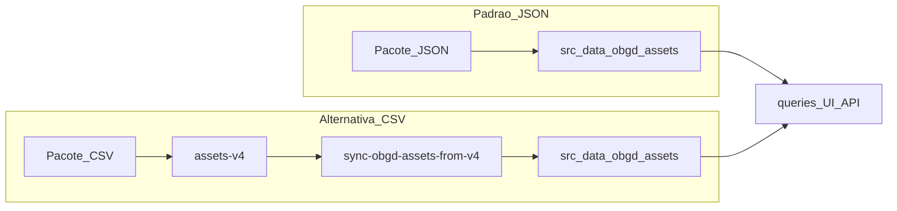

# Pipeline de dados OBGD

| Metadado | Valor |
| --- | --- |
| **Audiência** | Engenharia · Operação |
| **Status** | Canônico |
| **Última atualização** | 2026-09-22 |
| **Relacionados** | [Contrato de entrega](contrato-entrega-dados.md) · [Pipeline de geração](pipeline-geracao-dados.md) · [Escopos e schema](escopos-e-schema.md) · [Fontes e exportação](fontes-e-exportacao.md) · [Deploy](../05-operacao/deploy-e-hospedagem.md) · [Índice](../README.md) |

O **formato do pacote** esperado pela plataforma está em [Contrato de entrega de dados](contrato-entrega-dados.md). A construção do pacote a partir das fontes brutas será documentada em [Pipeline de geração](pipeline-geracao-dados.md) (frente de dados).

---

## 1. Resumo

O app consome o subset versionado em [`src/data/obgd/assets/`](../../src/data/obgd/assets/).

- **Padrão:** a frente de dados entrega **JSON** já alinhados a esse inventário.
- **Alternativa:** entrega em **CSV** → pasta `src/data/obgd/assets-v4/` → script de sync gera o subset JSON.

Edição de referência do índice no app: **2026** (`ANO_INDICE`).



---

## 2. Onde estão os dados?

| Pergunta | Resposta |
| --- | --- |
| Onde o app lê? | `src/data/obgd/assets/` — versionado no Git |
| Entrega padrão | JSON → atualizar diretamente `src/data/obgd/assets/` |
| Entrega alternativa (CSV) | Pacote em `src/data/obgd/assets-v4/` + sync |
| Como atualizar? | Ver seção 7 |

README curto dos assets: [`src/data/obgd/assets/README.md`](../../src/data/obgd/assets/README.md).

---

## 3. Inventário versionado (app)

```
src/data/obgd/assets/
├── indice_long_por_objetivo.json
├── detalhes_nacional.json
├── detalhes_estadual.json
├── detalhes_municipios.json
├── variaveis-por-objetivo-nivel.json
└── dados/
    ├── ente.json
    ├── fonte.json
    ├── indicador.json          # tags[] + audiencia
    ├── objetivo_engd.json
    ├── tag.json                # 16 tags
    └── indice_por_tag.json     # média por ente × tag
```

Não versionar `indicador_valor.json` (volume alto). Não emitir `detalhes_capitais.json` (recorte Capitais removido da UI).

---

## 4. O que o sync v4 faz (somente entrega CSV)

Usado quando o pacote chega em CSV. Script: `scripts/sync-obgd-assets-from-v4.mjs`.

1. Converte CSVs flat → JSON (`ano_indice` vazio → `2026`). Descarta `indice_geral` e `n_objetivos_com_dados` se ainda vierem no CSV.
2. Filtra `tipo` / `nivel` `capital` da entrega bruta.
3. Copia entidades canônicas (incl. `tag` e `indicador` com `tags` / `audiencia`).
4. Pré-calcula `indice_por_tag.json` agrupando por `(tipo, codigo, tag)` (lê `indicador_valor.json` na entrega; não o versiona).
5. Dispara a geração de `variaveis-por-objetivo-nivel.json`.
6. **Não** copia `indicador_valor.json`.

### Por que pré-calcular `indice_por_tag`?

Embutir `indicador_valor` no bundle do client só para médias por tag é desnecessário. O score por tag é agregado offline; o front calcula o mínimo possível.

Fórmula:

```
para indicadores ativos com tag T
  join valores por indicador_chave
  agrupar por ente
  nota = média(valor_normalizado)   # 0–100, 1 casa decimal
```

Tags e objetivos ENGD são eixos **independentes**.

---

## 5. Camada de código

| Módulo | Papel |
| --- | --- |
| `src/data/obgd/types.ts` | Tipos (`TagRow`, `DetalheRow`, …) |
| `src/data/obgd/load.ts` | Importa assets; maps de tag e notas |
| `src/data/obgd/queries.ts` | Scores por objetivo filtrados por `ANO_INDICE` |
| `src/data/obgd/detalhes.ts` / `server.ts` | Drill-down |
| `src/data/tematicas/` | API pública das 16 tags para ranking/indicadores |

---

## 6. Catálogo oficial de tags (edição atual)

| id (slug) | Nome | Lado |
| --- | --- | --- |
| `conectividade` | Conectividade | cidadão |
| `canais-digitais-atendimento` | Canais digitais de atendimento | cidadão |
| `servicos-publicos-digitais` | Serviços públicos digitais | cidadão |
| `cidades-inteligentes` | Cidades inteligentes | cidadão |
| `pagamento-digital` | Pagamento digital | cidadão |
| `identidade-digital` | Identidade digital e autenticação | cidadão |
| `saude-digital` | Saúde digital | cidadão |
| `educacao-digital` | Educação digital | cidadão |
| `transparencia-dados-abertos` | Transparência e dados abertos | cidadão |
| `inclusao-acessibilidade` | Inclusão e acessibilidade | cidadão |
| `gestao-planejamento-ti` | Gestão e planejamento de TI | gestor |
| `servicos-digitais` | Sistemas e serviços digitais | gestor |
| `dados-interoperabilidade` | Dados e interoperabilidade | gestor |
| `seguranca-lgpd` | Segurança e LGPD | gestor |
| `contratacoes` | Contratações e compras | gestor |
| `infraestrutura` | Infraestrutura e plataformas | gestor |

Fonte canônica: `dados/tag.json`.

---

## 7. Como atualizar o snapshot na plataforma

### 7.1 Padrão — entrega em JSON

1. **Receber** o pacote JSON alinhado ao [contrato](contrato-entrega-dados.md) (inventário da seção 3).
2. **Atualizar** os arquivos correspondentes em `src/data/obgd/assets/` (substituir o snapshot anterior).
3. Se `variaveis-por-objetivo-nivel.json` ou `indice_por_tag.json` não vierem no pacote, gerar com os scripts do repositório (o sync CSV já gera ambos; em entrega JSON incompleta, alinhar com a frente de dados ou regenerar a partir do pacote completo).
4. **Validação rápida** (seção 8).
5. **Commitar** `src/data/obgd/assets/` (e código, se tipos/schema mudarem).
6. **Redeploy** conforme [Deploy e hospedagem](../05-operacao/deploy-e-hospedagem.md) §10.

### 7.2 Alternativa — entrega em CSV

1. **Receber** o pacote CSV (+ `dados/*.json` exigidos pelo sync).
2. **Substituir/atualizar** `src/data/obgd/assets-v4/`.
3. **Executar o sync:**

```bash
node --max-old-space-size=4096 scripts/sync-obgd-assets-from-v4.mjs
```

4. **Validação rápida** (seção 8).
5. **Commitar** `src/data/obgd/assets/`.
6. **Redeploy**.

### 7.3 Validação rápida (ambos os fluxos)

Nos três recortes (federal, estadual, municípios):

- Ranking por objetivo e por tag
- Indicadores (objetivos e temáticas)
- Drill-down até lista de variáveis / download

Se a frente de dados alterar colunas ou entidades, alinhar tipos/código e o [contrato](contrato-entrega-dados.md) **antes** de publicar.

### Pendências conhecidas na frente de dados

- `ano_indice` nulo na entrega bruta (no fluxo CSV, tratado como 2026 no sync).
- Ranking municipal dos objetivos 7, 8 e 10 pode estar vazio.
- Tags API / IA / emergentes: fora de escopo de UI nesta edição.

---

## 8. Como validar

1. Conferir presença de `dados/tag.json`, `dados/indice_por_tag.json` e `indice_long_por_objetivo.json` (com `ano_indice: 2026` quando aplicável).
2. `/ranking?nivel=estadual&por=objetivos` — números coerentes com o long.
3. `/ranking?nivel=estadual&por=tematicas&tema=conectividade` — 16 pills; scores reais.
4. `/indicadores?nivel=estadual&entes=sp&por=tematicas&tema=conectividade` — barras e lista reais.
5. `npx tsc --noEmit` quando houver mudança de schema.
