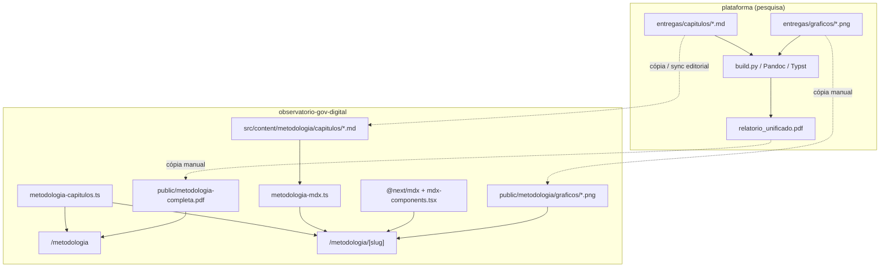

# Metodologia em Markdown — renderização nativa e PDF

| Metadado | Valor |
| --- | --- |
| **Audiência** | Engenharia · Operação |
| **Status** | Canônico |
| **Última atualização** | 2026-09-13 |
| **Rotas** | `/metodologia` · `/metodologia/[capitulo]` · `/metodologia-completa.pdf` |
| **Relacionados** | [Pipeline OBGD](../03-dados/pipeline-obgd.md) · [Fontes e exportação](../03-dados/fontes-e-exportacao.md) · [Índice](../README.md) |

Documentação técnica e operacional da feature que publica o relatório metodológico como páginas nativas do portal (Markdown → MDX → Next.js) e oferece o download do PDF consolidado.

---

## 1. Visão geral

O relatório metodológico é mantido em **Markdown (GFM)** e publicado de duas formas no portal:

| Canal | O que é | Onde vive |
| --- | --- | --- |
| **Web nativa** | Cada capítulo/anexo/referências vira uma página Next.js, tipografada com o design system | `src/content/metodologia/capitulos/*.md` → rotas `/metodologia/...` |
| **PDF para download** | Arquivo único servido como asset estático | `public/metodologia-completa.pdf` → `/metodologia-completa.pdf` |

Não há geração de PDF **dentro** deste repositório. A compilação Markdown → PDF (Pandoc/LibreOffice e/ou Typst) fica no repositório de pesquisa **`plataforma`**. No portal, o PDF é um binário versionado em `public/`, atualizado por cópia manual quando a equipe libera uma nova entrega.

| Aspecto | Decisão |
| --- | --- |
| Formato de conteúdo | Markdown (`.md`), compilado como MDX |
| Bundler / integração | `@next/mdx` + `remark-gfm` + `rehype-slug` |
| Tipografia | Componentes em `src/mdx-components.tsx` |
| Registro de capítulos | Array TypeScript (`metodologiaCapitulos`) |
| Carregamento | Mapa de `import()` estáticos (`loadMetodologiaCapituloMdx`) |
| Geração de páginas | SSG (`generateStaticParams`, `dynamicParams = false`) |
| PDF no portal | Asset estático; **não** gerado a partir dos `.md` em build |
| Gráficos referenciados | PNGs em `public/metodologia/graficos/`; `MdxImg` reescreve `../graficos/` → `/metodologia/graficos/` |

### Fonte de verdade do domínio

Para conceitos metodológicos (indicadores, ENGD, índices, escopos), o projeto trata [`public/metodologia-completa.pdf`](../../public/metodologia-completa.pdf) como **oráculo** — ver [`AGENTS.md`](../../AGENTS.md) e [`.cursor/rules/metodologia-oraculo.mdc`](../../.cursor/rules/metodologia-oraculo.mdc).

> **Atenção de sincronismo:** o Markdown web pode estar mais atualizado que o PDF commitado (ou o contrário). Em conflito de conceito de domínio, prevalece o PDF oráculo até a equipe alinhar os dois artefatos.

---

## 2. Arquitetura



### Fluxo web (runtime / build)

1. O editor mantém (ou sincroniza) arquivos `.md` em `src/content/metodologia/capitulos/`.
2. Cada arquivo está registrado em `metodologiaCapitulos` (slug + título + ordem) e no mapa de imports de `loadMetodologiaCapituloMdx`.
3. No `next build` / `next dev`, `@next/mdx` compila os `.md` com GFM e slugs de heading.
4. A página do capítulo chama `loadMetodologiaCapituloMdx(file)`, recebe o componente React e renderiza dentro de `<article>`.
5. `useMDXComponents()` aplica tipografia, tabelas, listas e o tratamento de imagens/gráficos.

### Fluxo PDF (fora do Next)

1. Em `plataforma`, a equipe gera o relatório unificado e o PDF (ver seção 7).
2. O arquivo resultante é copiado para `observatorio-gov-digital/public/metodologia-completa.pdf`.
3. O hub `/metodologia` oferece o botão **Baixar metodologia em PDF** apontando para `/metodologia-completa.pdf`.

---

## 3. Arquivos envolvidos

### Conteúdo

| Arquivo / pasta | Papel |
| --- | --- |
| [`src/content/metodologia/capitulos/*.md`](../../src/content/metodologia/capitulos/) | Capítulos, anexos e referências renderizados no portal (17 arquivos) |
| [`src/content/metodologia/capitulos/CLAUDE.md`](../../src/content/metodologia/capitulos/CLAUDE.md) | Contrato editorial dos capítulos-objetivo (padrão dimensional); herdado do fluxo de pesquisa |
| `src/content/metodologia/capitulos/*.docx` | Fontes Word auxiliares (ex. revisão de literatura); **não** carregadas pelo app |

### Registro, loader e tipagem

| Arquivo | Papel |
| --- | --- |
| [`src/data/metodologia-capitulos.ts`](../../src/data/metodologia-capitulos.ts) | `metodologiaCapitulos`, `getMetodologiaCapitulo`, `getMetodologiaCapituloNav`, `metodologiaCapituloHref` |
| [`src/lib/metodologia-mdx.ts`](../../src/lib/metodologia-mdx.ts) | `loadMetodologiaCapituloMdx(file)` — mapa explícito de `import()` |
| [`src/types/mdx.d.ts`](../../src/types/mdx.d.ts) | Declaração de módulos `*.md` / `*.mdx` |

### Renderização MDX

| Arquivo | Papel |
| --- | --- |
| [`src/mdx-components.tsx`](../../src/mdx-components.tsx) | `useMDXComponents()` — `h1`–`h4`, `p`, listas, tabelas, `hr`, `MdxImg` (reescreve paths de gráfico) |
| [`next.config.ts`](../../next.config.ts) | `createMDX`, `pageExtensions`, plugins remark/rehype |

### Rotas e UI

| Arquivo | Papel |
| --- | --- |
| [`src/app/(app)/metodologia/page.tsx`](../../src/app/(app)/metodologia/page.tsx) | Hub: intro, CTA do PDF, sumário |
| [`src/app/(app)/metodologia/[capitulo]/page.tsx`](../../src/app/(app)/metodologia/[capitulo]/page.tsx) | Página do capítulo (SSG, MDX, prev/next, metadata) |
| [`src/components/shared/variant-link.tsx`](../../src/components/shared/variant-link.tsx) | Links do sumário/navegação com prefixo `/v2` na variante B |
| [`src/components/shared/back-button.tsx`](../../src/components/shared/back-button.tsx) | Voltar para `/metodologia` |
| Header / footer | Entrada de navegação “Metodologia” |

### PDF e regras de domínio

| Arquivo | Papel |
| --- | --- |
| [`public/metodologia-completa.pdf`](../../public/metodologia-completa.pdf) | PDF servido em `/metodologia-completa.pdf` |
| [`AGENTS.md`](../../AGENTS.md) / [`CLAUDE.md`](../../CLAUDE.md) | Oráculo metodológico aponta para o PDF |
| [`.cursor/rules/metodologia-oraculo.mdc`](../../.cursor/rules/metodologia-oraculo.mdc) | Regra Cursor: consultar o PDF antes de inventar conceitos |

### Relacionado, mas fora do MDX

| Arquivo | Papel |
| --- | --- |
| [`src/app/(app)/metodologia/fontes/[fonte]/page.tsx`](../../src/app/(app)/metodologia/fontes/[fonte]/page.tsx) | Páginas por **pesquisa OBGD** (`fonte_id`, ex. `munic`) + export CSV — **não** usam o pipeline MDX. Slugs antigos de órgão (`ibge`, `cetic-br`, …) redirecionam para `/metodologia` (exceto quando o slug coincide com um `fonte_id`, ex. `anatel`). |

### Dependências npm (MDX)

- `@next/mdx`
- `@mdx-js/loader`
- `@mdx-js/react`
- `@types/mdx`
- `remark-gfm`
- `rehype-slug`

Não há dependência de Pandoc, Typst, LibreOffice ou gerador de PDF neste `package.json`. Scripts npm relevantes: apenas o ciclo Next (`dev`, `build`, `start`).

---

## 4. Conteúdo: convenções de autoria

### Local e nomes de arquivo

Diretório: `src/content/metodologia/capitulos/`

| Tipo | Padrão de arquivo | Exemplo |
| --- | --- | --- |
| Capítulos 1–13 | `capNN_<slug>.md` | `cap05_obj02_qualidade.md` |
| Anexos | `anexo_<letra>_<slug>.md` | `anexo_a_variaveis_excluidas.md` |
| Referências | `referencias_bibliograficas.md` | — |

O **slug da URL** (kebab-case) **não** está no nome do arquivo: vive só no registro TypeScript.

### Frontmatter

**Não há YAML frontmatter.** Arquivos começam com `# Título`. Linhas `---` no meio do texto são **réguas horizontais** (thematic breaks), não metadados.

### Recursos Markdown / GFM usados

Habilitados em `next.config.ts`:

- `remark-gfm` — tabelas, autolinks, strikethrough, task lists (quando presentes)
- `rehype-slug` — `id` nos headings (âncoras)

No conteúdo real aparecem com frequência: headings `#`–`####`, blockquotes, listas, tabelas pipe, ênfase, `---` antes de seções, imagens ``.

Os `.md` são **Markdown puro** (sem JSX embutido). O “MDX” aqui é o pipeline de compilação, não o uso de componentes custom no texto.

### Imagens e gráficos

Nos capítulos-objetivo, gráficos tipicamente apontam para caminhos relativos herdados do repositório de pesquisa:

```md


```

No portal:

- `MdxImg` reescreve `../graficos/...` → `/metodologia/graficos/...` e renderiza ``.
- Os PNGs vivem em [`public/metodologia/graficos/`](../../public/metodologia/graficos/) (cópia de `plataforma/entregas/graficos/`).
- `src` vazio ainda vira placeholder **“Gráfico indisponível”**.

Para atualizar os gráficos no portal: regenerar em `plataforma` e copiar de novo para `public/metodologia/graficos/`.

### Contrato editorial (capítulos-objetivo)

Para reescrever `cap04`–`cap13` no padrão dimensional, seguir [`src/content/metodologia/capitulos/CLAUDE.md`](../../src/content/metodologia/capitulos/CLAUDE.md). Esse contrato referencia scripts e paths do fluxo `plataforma` (`indices/`, worktrees, etc.) que **não** rodam a partir só deste repositório.

### Origem canônica do texto

Os `.md` do portal devem permanecer alinhados a `plataforma/entregas/capitulos/*.md` (cópia editorial). Divergências devem ser intencionais e documentadas na entrega.

---

## 5. Registro de capítulos (slug ↔ arquivo ↔ ordem)

Fonte: [`src/data/metodologia-capitulos.ts`](../../src/data/metodologia-capitulos.ts).

| order | slug (URL) | file (sem `.md`) | title |
| ---: | --- | --- | --- |
| 1 | `cap01-introducao` | `cap01_introducao` | 1. Introdução |
| 2 | `cap02-revisao-literatura` | `cap02_revisao_literatura` | 2. Revisão de Literatura |
| 3 | `cap03-metodologia` | `cap03_metodologia` | 3. Metodologia |
| 4 | `cap04-obj01-governanca` | `cap04_obj01_governanca` | 4. Objetivo 1: Governança do Governo Digital |
| 5 | `cap05-obj02-qualidade` | `cap05_obj02_qualidade` | 5. Objetivo 2: Qualidade dos Serviços Digitais |
| 6 | `cap06-obj03-identificacao-unica` | `cap06_obj03_identificacao_unica` | 6. Objetivo 3: Identificação Única |
| 7 | `cap07-obj04-seguranca-lgpd` | `cap07_obj04_seguranca_lgpd` | 7. Objetivo 4: Segurança e LGPD |
| 8 | `cap08-obj05-dados-interoperabilidade` | `cap08_obj05_dados_interoperabilidade` | 8. Objetivo 5: Dados e Interoperabilidade |
| 9 | `cap09-obj06-infraestrutura` | `cap09_obj06_infraestrutura` | 9. Objetivo 6: Infraestrutura |
| 10 | `cap10-obj07-inovacao` | `cap10_obj07_inovacao` | 10. Objetivo 7: Inovação e Tecnologias Emergentes |
| 11 | `cap11-obj08-eficiencia` | `cap11_obj08_eficiencia` | 11. Objetivo 8: Eficiência e Processos |
| 12 | `cap12-obj09-transparencia` | `cap12_obj09_transparencia` | 12. Objetivo 9: Transparência e Participação |
| 13 | `cap13-obj10-competencias` | `cap13_obj10_competencias` | 13. Objetivo 10: Competências em Governo Digital |
| 14 | `anexo-a-variaveis-excluidas` | `anexo_a_variaveis_excluidas` | Anexo A — Variáveis Excluídas |
| 15 | `anexo-b-lacunas-recomendacoes` | `anexo_b_lacunas_recomendacoes` | Anexo B — Lacunas em relação às recomendações da ENGD |
| 16 | `anexo-c-atas-entrevistas` | `anexo_c_atas_entrevistas` | Anexo C — Atas de entrevistas |
| 17 | `referencias-bibliograficas` | `referencias_bibliograficas` | Referências bibliográficas |

Helpers:

- `getMetodologiaCapitulo(slug)` — lookup
- `getMetodologiaCapituloNav(slug)` — `{ current, prev, next }`
- `metodologiaCapituloHref(slug)` — `/metodologia/${slug}`

> **Ordem vs `plataforma`:** no portal, anexos vêm **antes** das referências. O pipeline de unificação do `plataforma` pode ordenar referências antes dos anexos. Isso afeta só a concatenação do PDF de pesquisa, não as URLs do portal.

---

## 6. Runtime Next.js

### Configuração MDX

Em [`next.config.ts`](../../next.config.ts):

```ts
pageExtensions: ['js', 'jsx', 'md', 'mdx', 'ts', 'tsx']

createMDX({
  extension: /\.(md|mdx)$/,
  options: {
    remarkPlugins: ['remark-gfm'],
    rehypePlugins: ['rehype-slug'],
  },
})
```

### Hub `/metodologia`

- Lista `metodologiaCapitulos` com `VariantLink`.
- Botão de download: `<a href="/metodologia-completa.pdf" download>` (URL absoluta do asset público; **não** passa por `VariantLink`).

### Página `/metodologia/[capitulo]`

1. `generateStaticParams()` — um param por slug do registro.
2. `dynamicParams = false` — slug desconhecido → 404 (`not-found`).
3. `generateMetadata` — `title` = `cap.title`.
4. `loadMetodologiaCapituloMdx(current.file)` — componente MDX.
5. Render em `<article className="mt-8 max-w-3xl">`.
6. Navegação anterior/próximo com `VariantLink`.

### Por que o mapa de imports é explícito

O bundler exige caminhos estáticos. `loadMetodologiaCapituloMdx` mantém um `Record<string, () => Promise<MdxModule>>`. Arquivo novo sem entrada no mapa lança:

```txt
Capítulo MDX não encontrado: <file>
```

### Componentes MDX relevantes (`src/mdx-components.tsx`)

| Elemento | Comportamento |
| --- | --- |
| `h2` | `border-t` como separador de seção |
| `hr` | Régua; **oculto** quando o próximo irmão é `h2` (`has-[+h2]:hidden`) — evita linha duplicada com `---` + `##` |
| `p` | Se o único filho for imagem (`MdxImg` / `img`), não envolve em `<p>` — evita `<figure>` dentro de `<p>` (hydration error) |
| `img` / `MdxImg` | `../graficos/...` → `/metodologia/graficos/...` e ``; `src` vazio → placeholder |
| `table` | Wrapper com scroll horizontal; estilos de thead/tbody/td |

---

## 7. Pipeline de PDF (`plataforma`)

Este repositório **não** executa os passos abaixo. Eles documentam a origem do artefato que deve alimentar `public/metodologia-completa.pdf`.

Arquivos típicos no repo de pesquisa (caminhos relativos a `plataforma/`):

| Path | Papel |
| --- | --- |
| `entregas/capitulos/*.md` | Capítulos canônicos |
| `entregas/graficos/` | PNGs usados na diagramação |
| `entregas/gerar_relatorio_unificado.py` | Monta `relatorio_unificado.md` |
| `entregas/gerar_pdf_capitulos.py` | Pandoc → DOCX → LibreOffice → PDF |
| `entregas/typst/diagramar_relatorio.py` | Markdown → Typst → PDF (layout Insper) |
| `entregas/typst/md_typst.py` | Conversão MD → Typst |
| `entregas/typst/insper-relatorio.typ` | Template Typst |
| `build.py` | Orquestra gráficos + caminhos de PDF |

Fluxo resumido (pesquisa):

```bash
# No repositório plataforma (uv / Python do projeto)
uv run python build.py
# ou passos parciais: unificar MD → Pandoc/LibreOffice e/ou Typst
```

Saídas esperadas (nomes podem variar conforme o script):

- `entregas/relatorio_unificado.pdf`
- e/ou `entregas/typst/saida/relatorio_unificado.pdf`

**Atualização no portal:**

```bash
cp caminho/para/relatorio_unificado.pdf \
  observatorio-gov-digital/public/metodologia-completa.pdf
```

Em seguida, revisar o download em `/metodologia` e versionar o binário se for o processo de release.

Não há job de CI neste repositório que regenere ou sincronize o PDF automaticamente.

---

## 8. Operações comuns

### Atualizar o texto de um capítulo existente

1. Editar (ou re-copiar de `plataforma`) o `.md` em `src/content/metodologia/capitulos/`.
2. Manter título `#` coerente com o `title` do registro (o H1 do MDX é a fonte visual do título na página).
3. Rodar `npm run dev` e abrir `/metodologia/<slug>`.
4. Não é necessário regenerar PDF só para preview web — mas alinhar o PDF oráculo quando o conteúdo metodológico mudar de forma relevante.

### Adicionar um novo capítulo / anexo

1. Criar `src/content/metodologia/capitulos/<file>.md`.
2. Incluir entrada em `metodologiaCapitulos` (`slug`, `file`, `title`, `order`).
3. Incluir o mesmo `file` no mapa `modules` de `loadMetodologiaCapituloMdx`.
4. Conferir sumário, página, prev/next e SSG (`generateStaticParams` já lê o array).
5. Se houver gráficos novos: copiar PNGs de `plataforma/entregas/graficos/` para `public/metodologia/graficos/`.

### Checklist de sync pesquisa → portal

- [ ] Capítulos `.md` alinhados a `plataforma/entregas/capitulos/`
- [ ] Registro + mapa de imports atualizados (se houver arquivo novo)
- [ ] PNGs alinhados a `plataforma/entregas/graficos/` em `public/metodologia/graficos/`
- [ ] PDF regenerado em `plataforma` e copiado para `public/metodologia-completa.pdf`
- [ ] Spot-check: hub, um capítulo com tabela, um com `---` + `##`, um com ``
- [ ] Variante B (`/v2/...`): sumário e prev/next com prefixo; PDF continua em `/metodologia-completa.pdf`

---

## 9. Limitações e armadilhas conhecidas

1. **PDF ≠ build a partir dos `.md` do portal** — o download é um arquivo estático; pode divergir do Markdown web.
2. **Gráficos desatualizados** — `public/metodologia/graficos/` é cópia manual; regenerar em `plataforma` e recopiar quando os PNGs mudarem.
3. **Duplo registro obrigatório** — esquecer `metodologia-mdx.ts` quebra o load mesmo com entrada no array de capítulos.
4. **`---` + `##`** — corrigido no `hr` (`has-[+h2]:hidden`); não remova o `border-t` do `h2` sem revisar capítulos sem `---`.
5. **Imagem sozinha em parágrafo** — corrigido com unwrap no componente `p`; regressões aqui voltam o hydration error de `<figure>` dentro de `<p>`.
6. **Link do PDF e variante B** — o CTA do PDF não usa `VariantLink` (caminho absoluto do asset).
7. **Ordem anexos/referências** — pode diferir da concatenação do PDF em `plataforma`.
8. **`CLAUDE.md` dos capítulos** — paths e scripts de pesquisa; não assumir que `uv run python indices/...` existe neste repo.
9. **Fontes (`/metodologia/fontes/...`)** — feature irmã; documentada no fluxo de dados/tags, não neste pipeline MDX.

---

## 10. Documentação relacionada

| Doc | Relação |
| --- | --- |
| [`AGENTS.md`](../../AGENTS.md) | Oráculo PDF; índice do projeto |
| [`src/content/metodologia/capitulos/CLAUDE.md`](../../src/content/metodologia/capitulos/CLAUDE.md) | Autoria dimensional dos capítulos-objetivo |
| [Pipeline OBGD](../03-dados/pipeline-obgd.md) | Dados, tags e sync |
| [Fontes e exportação](../03-dados/fontes-e-exportacao.md) | Páginas `/metodologia/fontes` e CSV |

---

## 11. Resumo executivo

A feature “metodologia em Markdown nativa” neste repositório é o **pipeline web**: Markdown versionado → MDX/Next → páginas SSG tipografadas, com sumário, navegação entre capítulos e download de um PDF estático. A **produção tipográfica do PDF** e dos gráficos oficiais permanece no repositório **`plataforma`**; o portal consome o resultado como `public/metodologia-completa.pdf` e como PNGs em `public/metodologia/graficos/`, reescritos por `MdxImg` a partir dos paths `../graficos/` do Markdown.
