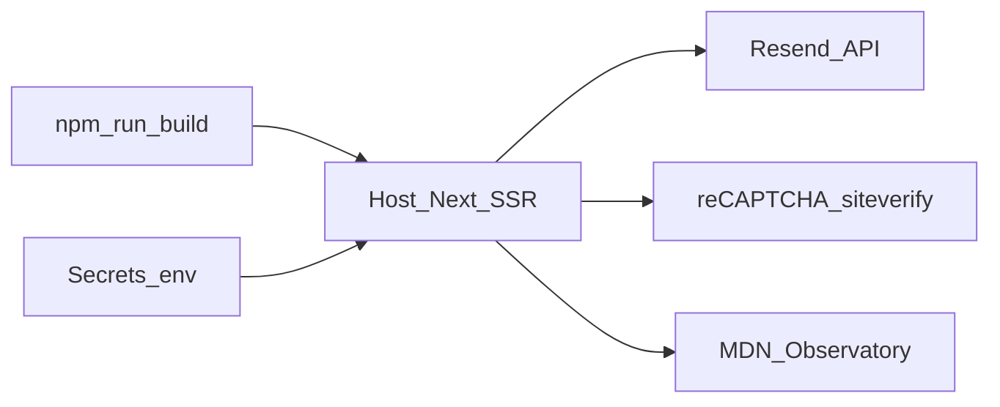

# Deploy e hospedagem

| Metadado | Valor |
| --- | --- |
| **Audiência** | Operação · Engenharia |
| **Status** | Canônico |
| **Última atualização** | 2026-09-13 |
| **Relacionados** | [Variáveis de ambiente](variaveis-de-ambiente.md) · [Segurança](seguranca-headers.md) · [Contato](../04-features/contato-resend.md) · [Índice](../README.md) |

---

## 1. Situação atual e planejada

| Fase | Responsável | Observação |
| --- | --- | --- |
| Inicial | Insper | Deploy típico em plataforma compatível com Next.js (ex.: Vercel no host de referência do Observatory) |
| Longo prazo | MBC | Migração planejada para **AWS** — runbook detalhado da AWS ainda não faz parte deste repositório |

Este documento cobre o que é verificável no código e nos processos já descritos (env, Resend, CSP, Observatory). Não inventa passos de infraestrutura AWS inexistentes no repo.

---

## 2. Checklist de deploy

1. Definir secrets conforme [Variáveis de ambiente](variaveis-de-ambiente.md).
2. Garantir domínio verificado no Resend (SPF, DKIM; DMARC recomendado) antes de usar remetente de produção.
3. Cadastrar o host de produção no admin do reCAPTCHA v2 Invisible **antes** do cutover de DNS.
4. Confirmar saída HTTPS do host para a API Resend e para `https://www.google.com/recaptcha/api/siteverify`.
5. Build e smoke: home, indicadores, ranking (se variante A), metodologia, `/contato`.
6. Envio real de teste em `/contato` e validação de Reply-To.
7. **Rescan** no [MDN HTTP Observatory](https://developer.mozilla.org/en-US/observatory/analyze?host=observatorio-gov-digital.vercel.app) após mudanças de CSP.
8. Se `NEXT_PUBLIC_RANKING_MODE=off`, validar que `/ranking` redireciona e que `/indicadores/.../[objetivo]` ainda oferece download.

---

## 3. Variante A/B em produção

| Objetivo | Configuração |
| --- | --- |
| Ranking visível (A) | `NEXT_PUBLIC_RANKING_MODE=on` (ou omitir conforme parser default do código) |
| Ranking oculto (B) | `NEXT_PUBLIC_RANKING_MODE=off` **ou** tráfego pelo prefixo `/v2` |

O modo não é escolhido pelo visitante final como preferência persistente; é decisão de admin/deploy (ou URL `/v2` para teste).

---

## 4. Contato em produção

Resumo; detalhe em [Contato (Resend)](../04-features/contato-resend.md) §6.2:

- Remetente em domínio verificado.
- Destino institucional: `mbc@mbc.org.br` (quando DNS/Resend permitirem).
- Keys reCAPTCHA de produção (não as de teste).
- Ownership sugerido: conta Resend e reCAPTCHA — time técnico Insper/MBC; caixa de destino — MBC / equipe de contato; DNS — TI do dono do domínio.

---

## 5. Segurança pós-deploy

- Não afrouxar `script-src` com `'unsafe-inline'`.
- Não remover `connection()` do root layout.
- Origens Google do reCAPTCHA apenas em `/contato` (e `/v2/contato`).
- Procedimento de verificação: [Segurança (headers)](seguranca-headers.md).

---

## 6. Migração futura Insper → AWS (MBC)

Itens a planejar quando o runbook AWS existir (fora do escopo atual deste arquivo):

- Provisionamento do runtime Next.js (SSR) e secrets.
- Domínio público e certificados TLS.
- Cadastro do novo host no reCAPTCHA **antes** do apontamento DNS.
- Revalidação Resend (domínio / DNS) e Observatory no host novo.
- Política de backup dos assets versionados e processo de release de dados.
