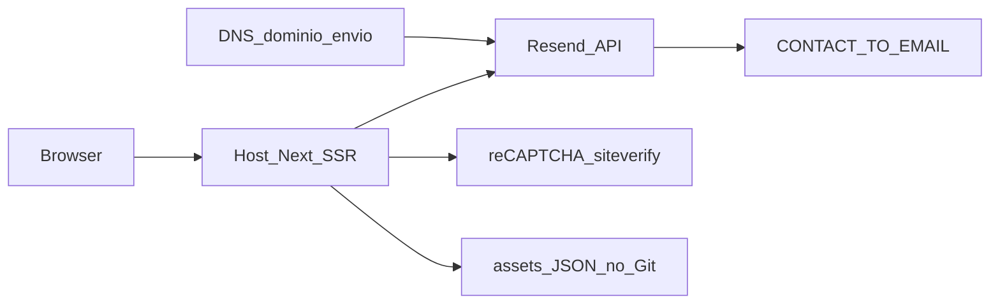
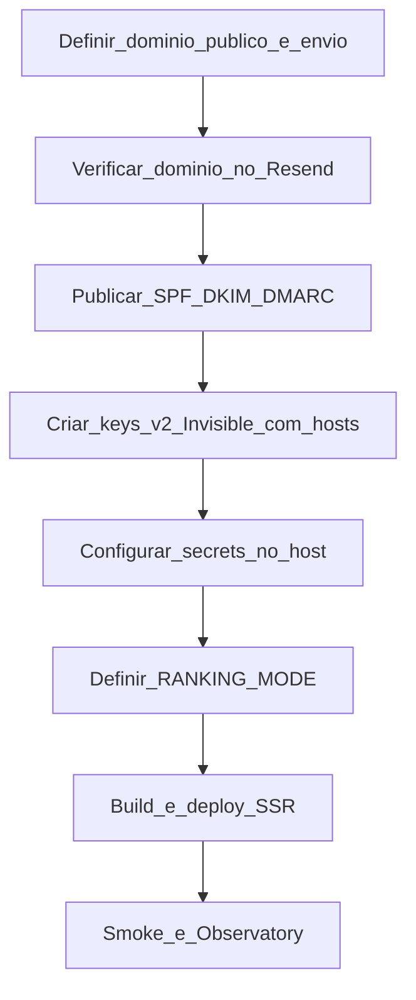

# Handoff e deploy em produção

| Metadado                        | Valor                                                                                                                                                                                                                       |
| ------------------------------- | --------------------------------------------------------------------------------------------------------------------------------------------------------------------------------------------------------------------------- |
| **Audiência**            | Operação · Engenharia · Handoff                                                                                                                                                                                         |
| **Status**                | Canônico                                                                                                                                                                                                                   |
| **Última atualização** | 2026-09-26                                                                                                                                                                                                                  |
| **Relacionados**          | [Variáveis de ambiente](variaveis-de-ambiente.md) · [Containerização](containerizacao.md) · [Segurança](seguranca-headers.md) · [Contato](../04-features/contato-resend.md) · [Contrato de dados](../03-dados/contrato-entrega-dados.md) · [Índice](../README.md) |

Runbook operacional para colocar o Observatório Brasileiro de Governo Digital (OBGD) em produção e transferir a operação à equipe receptora (Insper ou MBC). Os papéis abaixo são descritos por **função**.

---

## 1. Propósito

Este documento cobre:

1. Contas e serviços externos obrigatórios antes do go-live (Resend, reCAPTCHA, DNS).
2. Secrets e modo de ranking.
3. Requisitos de runtime (Next.js com SSR).
4. Procedimento de deploy e checklist de aceitação.
5. Atualização do snapshot de dados estáticos.
6. Checklist de handoff à equipe que assumir a operação.

Detalhes de implementação do formulário: [Contato (Resend)](../04-features/contato-resend.md). Detalhes de CSP: [Segurança (headers)](seguranca-headers.md). Formato dos dados: [Contrato de entrega](../03-dados/contrato-entrega-dados.md).

---

## 2. Papéis e ownership

Preencher a coluna **Titular** na transferência. A hospedagem pode ficar com Insper ou MBC.

| Função                  | Responsabilidade                                                                  | Titular                      |
| ------------------------- | --------------------------------------------------------------------------------- | ---------------------------- |
| Operador de hospedagem    | Build, secrets no host, domínio público, TLS, deploys                           | Insper**ou** MBC (TBD) |
| Conta Resend / API keys   | Domínio de envio,`RESEND_API_KEY`, remetente                                   | TBD                          |
| DNS do domínio de envio  | Registros SPF, DKIM; DMARC recomendado                                            | TI do dono do domínio       |
| Caixa`CONTACT_TO_EMAIL` | Triagem das mensagens (`mbc@mbc.org.br`)                                        | MBC                          |
| Conta Google reCAPTCHA    | Keys v2 Invisible e lista de hosts                                                | TBD                          |
| Código / releases        | Repositório, PRs, versionamento de assets                                        | Engenharia                   |
| Dados / snapshot OBGD     | Pacote de entrega (frente de dados); incorporar JSON (ou sync se CSV) + commit dos assets (engenharia) | Frente de dados + Engenharia |

---

## 3. Dependências de produção



O portal **não** usa banco de aplicação para o índice: os indicadores vêm de `src/data/obgd/assets/` versionados no Git. O formulário `/contato` depende de Resend + reCAPTCHA em tempo de execução.

---

## 4. Pré-requisitos de contas e acesso

| Recurso                                                  | Uso                                   |
| -------------------------------------------------------- | ------------------------------------- |
| Repositório Git                                         | Código e assets versionados          |
| Node.js LTS + npm                                        | Build local ou CI (`npm run build`) |
| Painel do host (ex.: Vercel ou futuro AWS)               | Deploy SSR, secrets, domínio do site |
| Conta[Resend](https://resend.com)                         | Envio de e-mail do formulário        |
| Acesso DNS do domínio de envio                          | Verificação SPF/DKIM no Resend      |
| [Admin reCAPTCHA](https://www.google.com/recaptcha/admin) | Par site key + secret (v2 Invisible)  |
| Caixa institucional de destino                           | Receber e responder mensagens         |

Host de referência atual do scan MDN Observatory: `observatorio-gov-digital.vercel.app`. O provedor final de produção pode ser outro, desde que suporte **Next.js App Router com SSR**.

---

## 5. Ordem obrigatória pré-deploy



### 5.1 Domínio público e domínio de envio

1. Definir o hostname público do portal (ex.: `observatorio….br`).
2. Definir o domínio que autenticará o remetente Resend (pode ser o mesmo ou um subdomínio de e-mail, ex. `noreply@…`).

### 5.2 Resend

1. Criar ou acessar a conta Resend da operação.
2. Verificar o domínio de envio no painel Resend ([documentação de domínios](https://resend.com/docs/dashboard/domains/introduction)).
3. Publicar no DNS os registros indicados (SPF, DKIM; DMARC recomendado).
4. Aguardar status verificado no painel.
5. Gerar `RESEND_API_KEY` (`re_…`).
6. Definir:
   - `RESEND_FROM_EMAIL` — formato `Nome <email@dominio-verificado>` (**não** usar `onboarding@resend.dev` em produção).
   - `CONTACT_TO_EMAIL` — produção: `mbc@mbc.org.br`.

Com remetente de teste `onboarding@resend.dev`, o Resend só entrega para o e-mail da conta Resend; a caixa institucional não recebe de forma confiável.

### 5.3 Google reCAPTCHA v2 Invisible

1. No [admin do reCAPTCHA](https://www.google.com/recaptcha/admin), criar chave do tipo **reCAPTCHA v2 → Invisible** (não v3).
2. Cadastrar **todos** os hosts de produção (e preview, se aplicável) **antes** do cutover de DNS.
3. Copiar o par:
   - `NEXT_PUBLIC_RECAPTCHA_SITE_KEY` (pública; entra no bundle do cliente)
   - `RECAPTCHA_SECRET_KEY` (somente servidor)
4. **Proibir** as keys de teste do FAQ do Google em produção — elas fazem o `siteverify` passar mesmo com token inválido.
5. Atualizar as duas variáveis no **mesmo** deploy e forçar rebuild (variável `NEXT_PUBLIC_*`).

Detalhe de CSP e widget: [Contato §7.1](../04-features/contato-resend.md).

### 5.4 Egress de rede do runtime

O host precisa de saída HTTPS para:

- API do Resend
- `https://www.google.com/recaptcha/api/siteverify`

### 5.5 Modo de ranking

Decidir antes do build:

| Objetivo                      | Configuração                   |
| ----------------------------- | -------------------------------- |
| Ranking visível (variante A) | `NEXT_PUBLIC_RANKING_MODE=on`  |
| Ranking oculto (variante B)   | `NEXT_PUBLIC_RANKING_MODE=off` |

O prefixo `/v2` força a variante B sem alterar o env (útil para teste). Valores legados no parser: `full` → on, `farol` → off.

---

## 6. Secrets de produção

Modelo: [`.env.example`](../../.env.example). Matriz completa: [Variáveis de ambiente](variaveis-de-ambiente.md).

| Variável                          | Obrigatória  | Escopo          |
| ---------------------------------- | ------------- | --------------- |
| `NEXT_PUBLIC_RANKING_MODE`       | Recomendada   | Cliente + proxy |
| `RESEND_API_KEY`                 | Sim (contato) | Servidor        |
| `RESEND_FROM_EMAIL`              | Sim (contato) | Servidor        |
| `CONTACT_TO_EMAIL`               | Sim (contato) | Servidor        |
| `NEXT_PUBLIC_RECAPTCHA_SITE_KEY` | Sim (contato) | Cliente         |
| `RECAPTCHA_SECRET_KEY`           | Sim (contato) | Servidor        |

Exemplo de valores (sem secrets reais):

```bash
NEXT_PUBLIC_RANKING_MODE=on
RESEND_API_KEY=re_...
RESEND_FROM_EMAIL=Observatório <noreply@dominio-verificado>
CONTACT_TO_EMAIL=mbc@mbc.org.br
NEXT_PUBLIC_RECAPTCHA_SITE_KEY=site_key_de_producao
RECAPTCHA_SECRET_KEY=secret_de_producao
```

Preferir o cofre de secrets do provedor de hospedagem. Nunca versionar `.env` com chaves reais.

---

## 7. Requisitos de runtime

| Requisito                                                                | Motivo                                                                          |
| ------------------------------------------------------------------------ | ------------------------------------------------------------------------------- |
| Next.js App Router com**SSR**                                      | CSP com nonce por request;`connection()` no root layout                       |
| `npm run build` + processo Node (`npm start` ou equivalente do host) | Não usar`output: 'export'` / site estático puro. `output: 'standalone'` é o default da imagem Docker (SSR preservado) e fica de fora quando a Vercel define `VERCEL` — ver [Containerização](containerizacao.md) |
| Node.js compatível com o`package.json`                                | Build e runtime                                                                 |
| Assets em`src/data/obgd/assets/` no Git                                | Índice e tags; sync de dados**não** é passo automático de cada deploy |

Scripts:

```bash
npm install
npm run build
npm start
```

---

## 8. Procedimento de deploy

Passos agnósticos ao provedor:

1. Obter o código na revisão a publicar (clone ou pipeline CI).
2. Configurar secrets no ambiente do host (seção 6).
3. Instalar dependências (`npm install` / cache do CI).
4. Executar `npm run build`.
5. Publicar o artefato / iniciar o processo Node com a app na porta definida pelo host.
6. Associar o domínio público ao deploy e validar TLS (HTTPS).
7. Executar o checklist da seção 9.

Em plataformas com preview por branch, validar primeiro no preview (com hosts do preview cadastrados no reCAPTCHA) e só então promover a produção.

### 8.1 Host de referência atual

O scan MDN Observatory usa `observatorio-gov-digital.vercel.app` como host de referência. Ao mudar o hostname definitivo, atualizar o alvo do Rescan e cadastrar o host no reCAPTCHA **antes** do apontamento DNS.

### 8.2 Migração planejada para AWS (MBC)

O artefato de runtime para o host do MBC é a imagem Docker. Build, tag, variáveis de build e subida: [Containerização](containerizacao.md).

Runbook detalhado da AWS **não** faz parte deste repositório ainda. No cutover, repetir:

1. Provisionar runtime Next.js com SSR e secrets.
2. Cadastrar o novo host no reCAPTCHA antes do DNS.
3. Revalidar domínio Resend / DNS de e-mail se o domínio de envio mudar.
4. Rescan Observatory no host novo.
5. Smoke completo (seção 9) e smoke de dados (seção 10).

---

## 9. Checklist pós-deploy (aceitação)

| # | Verificação                                                      | Resultado esperado                                                               |
| -: | ------------------------------------------------------------------ | -------------------------------------------------------------------------------- |
| 1 | Home`/`                                                          | Carrega sem erro; seções principais visíveis                                  |
| 2 | `/indicadores`                                                   | Explorer responde; URL com query restaura estado                                 |
| 3 | Ranking (se`on`)                                                 | `/ranking` lista entes; Obj. 3 desabilitado na UI                              |
| 4 | Ranking (se`off`)                                                | `/ranking` redireciona; download via `/indicadores/.../[objetivo]`           |
| 5 | `/metodologia`                                                   | Hub e PDF`/metodologia-completa.pdf`                                           |
| 6 | `/contato`                                                       | Envio real chega em`CONTACT_TO_EMAIL`; Reply-To = e-mail do visitante          |
| 7 | Console em`/contato`                                             | Sem violação de CSP no widget reCAPTCHA                                        |
| 8 | Headers                                                            | `curl -sI https://<host>` — CSP, `nosniff`, `DENY`, Referrer-Policy, HSTS |
| 9 | [MDN Observatory](https://developer.mozilla.org/en-US/observatory/) | Rescan no host de produção; meta A+                                            |

Troubleshooting de contato: [Contato §10](../04-features/contato-resend.md).

---

## 10. Atualização de dados em produção

O índice é estático no Git. Nova edição da frente de dados:

1. Receber o pacote conforme [Contrato de entrega de dados](../03-dados/contrato-entrega-dados.md) (**padrão: JSON**; alternativa: CSV).
2. Incorporar o snapshot conforme [Pipeline OBGD — como atualizar](../03-dados/pipeline-obgd.md) (cópia JSON ou sync a partir de CSV).
3. Commitar `src/data/obgd/assets/` (e código, se o schema mudar).
4. Redeploy da aplicação (mesmo pipeline da seção 8).
5. Validação rápida de ranking/indicadores nos três recortes.

A geração do pacote a partir das fontes brutas será documentada em [Pipeline de geração de dados](../03-dados/pipeline-geracao-dados.md) (frente de dados — pendente).

---

## 11. Operação contínua

| Situação                      | Ação                                                                                                 |
| ------------------------------- | ------------------------------------------------------------------------------------------------------ |
| Vazamento de`RESEND_API_KEY`  | Revogar e gerar nova key no Resend; atualizar secret no host                                           |
| Vazamento / rotação reCAPTCHA | Recriar par v2 Invisible; atualizar as duas env vars no mesmo deploy + rebuild                         |
| Novo domínio público          | Cadastrar host no reCAPTCHA**antes** do DNS; Rescan Observatory                                  |
| Terceiro script / analytics     | Incluir origem em`buildCsp()` **antes** de produção — ver [Segurança](seguranca-headers.md) |

### O que não fazer

- Usar keys de teste do reCAPTCHA em produção.
- Usar `onboarding@resend.dev` como From de produção.
- Afrouxar `script-src` com `'unsafe-inline'`.
- Remover `connection()` do root layout.
- Abrir origens Google do reCAPTCHA no CSP global (somente `/contato`).
- Fazer export estático do Next.js (quebra nonce/CSP).

---

## 12. Checklist de handoff (equipe receptora)

- [ ] Papéis da seção 2 preenchidos (titulares).
- [ ] Acesso ao repositório Git concedido.
- [ ] Acesso ao painel do host e ao cofre de secrets.
- [ ] Conta Resend e domínio de envio documentados (ou transferidos).
- [ ] Conta Google reCAPTCHA e lista de hosts documentadas.
- [ ] DNS de e-mail e do site documentados (contatos TI).
- [ ] Caixa `mbc@mbc.org.br` com processo de triagem.
- [ ] Secrets de produção configurados e validados (seção 9, item 6).
- [ ] Smoke pós-deploy assinado (seção 9).
- [ ] Equipe ciente do fluxo de atualização de dados (seção 10 + contrato).
- [ ] Links deste runbook e do [`docs/README.md`](../README.md) conhecidos pela operação.
