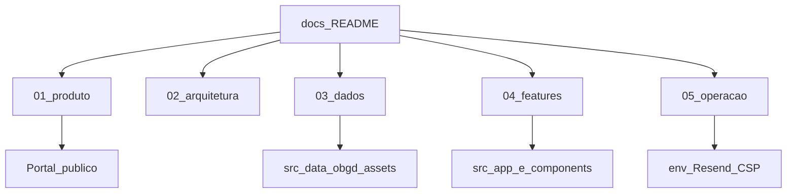

# Documentação — Observatório Brasileiro de Governo Digital (OBGD)

Índice mestre da documentação do portal. Este hub organiza o material por audiência e por tema.

| Metadado                        | Valor                                                                                                          |
| ------------------------------- | -------------------------------------------------------------------------------------------------------------- |
| **Status**                | Canônico                                                                                                      |
| **Última atualização** | 2026-09-26                                                                                                     |
| **Repositório**          | [github.com/obsgovdigital/observatorio-gov-digital](https://github.com/obsgovdigital/observatorio-gov-digital)  |
| **Idioma**                | pt-BR                                                                                                          |

Voltar ao [`README.md`](../README.md) da raiz do repositório.

---

## Por audiência

### Cliente e parceiros institucionais

Visão de produto, escopo e rotas públicas — sem requisitos de ambiente de desenvolvimento.

| Documento                                            | Conteúdo                                                  |
| ---------------------------------------------------- | ---------------------------------------------------------- |
| [Visão geral](01-produto/visao-geral.md)             | O que é o Observatório, parceiros, ENGD, fontes e prazos |
| [Escopo e decisões](01-produto/escopo-e-decisoes.md) | Decisões de produto e comportamento da plataforma         |
| [Mapa de rotas](01-produto/mapa-de-rotas.md)          | Rotas públicas, variantes A/B e navegação               |
| [Glossário](01-produto/glossario.md)                 | Índice, níveis, tags, variável, fonte                   |

### Engenharia

Arquitetura, dados, features e convenções de código.

| Documento                                                     | Conteúdo                                        |
| ------------------------------------------------------------- | ------------------------------------------------ |
| [Visão de arquitetura](02-arquitetura/visao-arquitetura.md)   | Camadas App Router, dados, SSR/CSP               |
| [Stack e repositório](02-arquitetura/stack-e-repositorio.md)  | Stack, árvore`src/` e convenções            |
| [Pipeline OBGD](03-dados/pipeline-obgd.md)                     | Atualizar snapshot (JSON padrão ou sync a partir de CSV) |
| [Contrato de entrega de dados](03-dados/contrato-entrega-dados.md) | Formato do pacote estático esperado pela plataforma |
| [Pipeline de geração de dados](03-dados/pipeline-geracao-dados.md) | Geração do snapshot (frente de dados — pendente) |
| [Escopos e schema](03-dados/escopos-e-schema.md)               | Federal, estadual, municípios e modelo de dados |
| [Fontes e exportação](03-dados/fontes-e-exportacao.md)       | Links oficiais e CSV curado                      |
| [Disclaimer de variáveis](03-dados/disclaimer-variaveis.md)   | Contagem nível × objetivo no ranking           |
| [Indicadores e ranking](04-features/indicadores-e-ranking.md)  | Explorers, drill-down e modo temáticas          |
| [Contato (Resend)](04-features/contato-resend.md)              | Formulário`/contato`, anti-abuso, operação  |
| [Metodologia (MDX + PDF)](04-features/metodologia-conteudo.md) | Capítulos web e PDF estático                   |

### Operação e infraestrutura

| Documento                                                     | Conteúdo                                       |
| ------------------------------------------------------------- | ----------------------------------------------- |
| [Setup local](05-operacao/setup-local.md)                      | Instalação, scripts e qualidade de código    |
| [Variáveis de ambiente](05-operacao/variaveis-de-ambiente.md) | Matriz completa (`.env.example`)              |
| [Containerização](05-operacao/containerizacao.md)              | Imagem Docker: build, inspeção e execução     |
| [Deploy e hospedagem](05-operacao/deploy-e-hospedagem.md)      | Handoff e runbook de produção (Resend, reCAPTCHA, secrets, smoke, dados) |
| [Segurança (headers)](05-operacao/seguranca-headers.md)       | CSP com nonce, HSTS, MDN Observatory            |

---

## Domínio metodológico (oráculo)

Para indicadores, objetivos da ENGD, cálculo de índices, fontes e escopos federativos, a fonte de verdade do domínio é o PDF:

- Arquivo: [`public/metodologia-completa.pdf`](../public/metodologia-completa.pdf)
- Rota pública: `/metodologia-completa.pdf`

Em conflito com resumos em Markdown, mocks ou memória de ferramentas, o PDF prevalece. Detalhe do pipeline web: [Metodologia (MDX + PDF)](04-features/metodologia-conteudo.md).

---

## Mapa do conjunto

