# Acompanhamento da plataforma — migração UI e feedback do cliente

> **Documento canônico** do que foi decidido, implementado, adiado e do que ainda depende da frente de dados.
>
> Última atualização: **2026-08-20**
>
> Repositório: `observatorio-gov-digital`
>
> **Versão para o time (Word):** [`alinhamento-interno-pre-apresentacao.docx`](./alinhamento-interno-pre-apresentacao.docx) — resumo para feedback interno antes da apresentação com o cliente.

---

## 1. Contexto

Trabalho em paralelo:

| Papel           | Repositório                               | Função                                                   |
| --------------- | ------------------------------------------ | ---------------------------------------------------------- |
| Designer (Caio) | `observatorio-governo-digital-prototipo` | Exploração de UI/UX                                     |
| Engenharia      | `observatorio-gov-digital`               | Implementação oficial (Next.js, TypeScript, dados, a11y) |

A migração trouxe para o oficial as mudanças de UI do protótipo **depois** de `6fc045cc`, cruzadas com o feedback do cliente / Luiza (reunião ~**22/07/2026**) e decisões de produto fechadas na implementação.

**Não** foi objetivo desta fase: i18n PT/EN (protótipo tem; oficial permanece só PT).

---

## 2. Feedback do cliente / Luiza (e decisões fechadas)

Fonte: pontos levantados na conversa com o cliente (e alinhamento interno com Luiza / time). Abaixo: pedido → decisão → status na plataforma.

| #  | Pedido / ponto                                                      | Decisão                                                                                                               | Status                                    |
| -- | ------------------------------------------------------------------- | ---------------------------------------------------------------------------------------------------------------------- | ----------------------------------------- |
| 1  | Não usar**média / índice geral** entre objetivos           | Remover da UI; rankings e destaques só por**objetivo** (índice) ou, se houver, por **tag temática** | Feito                                     |
| 2  | Ranking pouco claro sobre o que ordena                              | Ordenar por objetivo ENGD**ou** categoria temática; label explícita; sem toggle de índice geral               | Feito                                     |
| 3  | Página de**variável** + série histórica isolada           | Remover rota e gráfico de série; variáveis só como**lista + download** na página do objetivo                | Feito                                     |
| 4  | **Objetivo 3** (Identificação Única) sem dados suficientes | Desabilitar na UI (chip + tooltip + toast);**manter** lacunas reais de cobertura dos objs. 8 e 10                | Feito (copy do tooltip ainda provisório) |
| 5  | **Tags / dimensões temáticas** (~50–60)                    | Entrega v3 com**16 tags** reais + scores (média por tag); UI desmockada                                      | Feito                                     |
| 6  | Versão**com** e **sem** ranking (teste A/B)            | Versão A =`/` com ranking; Versão B = `/v2` ou `NEXT_PUBLIC_RANKING_MODE=off`                                  | Feito                                     |
| 6b | Na versão sem ranking, falta caminho até o download das variáveis | Espelhar drill-down sob `/indicadores/[nivel]/[ente]/[objetivo]` (sem reabrir `/ranking` na B) | Feito                                     |
| 7  | Municípios extras (~100 mil hab., além de capitais)               | Um recorte **Municípios** (`municipios`, 319 ≥ 100 mil, inclui capitais). Recorte Capitais removido da UI. | **Feito** (assets-v4 + unificação) |
| 8  | Nota técnica dos objetivos com cobertura precária                 | Mock na metodologia + chips; validar com Luiza/Gabriel/Bruno                                                           | Feito (mock)                              |
| 9  | i18n                                                                | **Não** portar                                                                                                  | Fora de escopo                            |
| 10 | Loading / abertura da home (protótipo)                             | Implementado com`sessionStorage`, depois **removido** (UX + SEO)                                               | Removido                                  |

### Esclarecimento importante: índice (por objetivo) ≠ índice geral

- **Índice geral / média geral** — agregado transversal dos objetivos → **proibido na UI**.
- **Índice** — nota **de um objetivo** (0–100; média dos indicadores daquele objetivo) → **métrica principal** do ranking e do detalhe do ente. Na UI, o rótulo é **Índice** (antes “Sub-índice”; renomeado porque não há mais índice geral na plataforma).
- Campo de dados / código: `sub_indice` / `subIndice` (legado de schema) — não confundir com o rótulo exibido.

---

## 3. O que foi implementado (engenharia + produto)

### 3.1 Sistema visual e base

- Utilitários de traço / layout alinhados ao protótipo (`dash-y`, pills, etc.)
- Toast (Sonner) e **Tooltip** (shadcn/Radix) para chips desabilitados
- Componentes compartilhados: `FilterPill`, `ObjetivoChip`, `BandeiraEnte`, `MapaBrasil`, helpers de geo/bandeiras

### 3.2 Home (`/`)

- Hero com `PixelCanvas` + `PesoVariavel`
- Ordem de seções alinhada ao designer (recursos, lead, mapa quando ranking on, dados abertos, parceiros em grayscale)
- Miniaturas (`VisualPerfil`, `VisualMapa`, `VisualDados`)
- **Loading/abertura da home:** removida (não há mais overlay de intro)

### 3.3 Indicadores (`/indicadores`)

- Explorer no padrão do designer: nível, ordenar por (objetivos ENGD | temáticas), seleção de até 5 entes
- Radar por objetivos; comparativo temático com scores **mock**
- Estado compartilhável na URL: `nivel`, `entes`, `por`, `tema`
  Ex.: `/indicadores?nivel=estadual&entes=sp,rj&por=objetivos`
- Drill-down até variáveis/download (também na variante B): `/indicadores/[nivel]/[ente]` → `/indicadores/[nivel]/[ente]/[objetivo]`
  Ex.: `/indicadores/estadual/sp/privacidade-e-seguranca`; em `/v2/...` o prefixo é preservado
- No explorer (modo objetivos), clique no ente da legenda ou CTA “Ver variáveis e detalhes” leva à página do ente

### 3.4 Ranking (`/ranking`)

- Nível (estadual / municípios ≥100 mil; federal vai direto ao ente)
- Ordenar por objetivos ENGD ou categorias temáticas
- Chips de objetivo (Obj. 3 desabilitado) / pills de tag
- Distribuição + mapa (estadual) + tabela com bandeiras
- **Sem** índice geral; coluna principal = **Índice**
- Estado compartilhável na URL: `nivel`, `por`, `objetivo` | `tema`Ex.: `/ranking?nivel=municipios&por=objetivos&objetivo=privacidade-e-seguranca`
- Clique no ente (modo objetivos) leva `?objetivo={slug}` → detalhe dinâmico (não mais “sempre Obj. 1”)
- Badge com nome do ente no topo da coluna do gráfico “Posição no objetivo” → **removida**
- Página do objetivo: lista de variáveis + download; **sem** bloco de Recomendações (recomendações ENGD ficam em `/objetivos/[slug]`); ícones de fonte/download ao lado do título da variável
- UI compartilhada com o drill-down de Indicadores (`src/components/drilldown/`), com posições/distribuição só no ranking

### 3.5 Objetivo 3 e cobertura

- Lógica em `src/data/objectives-availability.ts`
- Lacunas reais de dados (ex. objs. 8/10 em alguns níveis) continuam vindas dos dados
- Obj. 3: bloqueio de produto na UI independentemente de haver linha no JSON

### 3.6 Versão A/B (ranking) e caminho até o download

| Variante | Como ativar                                                                 | Comportamento                |
| -------- | --------------------------------------------------------------------------- | ---------------------------- |
| A        | `/` (default)                                                             | Ranking disponível          |
| B        | prefixo`/v2/…` **ou** `NEXT_PUBLIC_RANKING_MODE=off` / `farol` | Sem ranking (redirect / nav); download via `/indicadores/.../[objetivo]` |

Arquivos-chave: `src/proxy.ts`, `src/lib/features/ranking-mode.ts`, `use-platform-variant.ts`, `VariantLink`, `src/components/drilldown/`.

#### Problema que motivou o espelho em Indicadores

O download das variáveis (`VariavelAcoes`) existia só em `/ranking/[nivel]/[ente]/[objetivo]`. Na variante B o proxy redireciona qualquer `/ranking*`, e o explorer de Indicadores parava nos gráficos — sem caminho até a lista de variáveis nos recortes **federal**, **estadual** e **municípios**.

**Decisão:** não reabrir `/ranking` na variante B (mantém o teste A/B). Ranking continua o caminho principal na variante A; Indicadores ganha o mesmo destino de download em **ambas** as variantes, sem UI de posição/distribuição.

#### Implementação

- Componentes compartilhados: `EnteDetail` e `ObjetivoVariaveis` em `src/components/drilldown/`
  - Props: `basePath` (`/ranking` | `/indicadores`) e `showRankingUi` (posições / `DistribuicaoChart` só no ranking)
- Rotas novas: `/indicadores/[nivel]/[ente]` e `/indicadores/[nivel]/[ente]/[objetivo]`
- Páginas de ranking refatoradas para os mesmos componentes
- No explorer (modo objetivos): clique no ente da legenda + CTA “Ver variáveis e detalhes”
- Links via `VariantLink` para preservar o prefixo `/v2`

#### Fluxo de navegação

```mermaid
flowchart TD
  subgraph varianteA [Variante A - com ranking]
    homeA["/"] --> ranking["/ranking"]
    ranking --> enteR["/ranking/nivel/ente"]
    enteR --> objR["/ranking/nivel/ente/objetivo"]
    objR --> dlR["Lista + VariavelAcoes"]
    homeA --> indA["/indicadores"]
    indA --> enteI1["/indicadores/nivel/ente"]
    enteI1 --> objI1["/indicadores/nivel/ente/objetivo"]
    objI1 --> dlI1["Lista + VariavelAcoes"]
  end

  subgraph varianteB [Variante B - sem ranking]
    homeB["/v2"] --> indB["/v2/indicadores"]
    indB -->|"CTA / legenda do ente"| enteI2["/v2/indicadores/nivel/ente"]
    enteI2 -->|"objetivo com dados"| objI2["/v2/indicadores/nivel/ente/objetivo"]
    objI2 --> dlI2["Lista + VariavelAcoes"]
    homeB -.->|"redirect"| blocked["/ranking bloqueado"]
  end
```

#### Exemplos por nível

| Nível | Exemplo (A) | Exemplo (B) |
| --- | --- | --- |
| Federal | `/indicadores/federal/brasil/{objetivo}` | `/v2/indicadores/federal/brasil/{objetivo}` |
| Estadual | `/indicadores/estadual/sp/privacidade-e-seguranca` | `/v2/indicadores/estadual/sp/...` |
| Municípios (≥100 mil) | `/indicadores/municipios/{municipio}/{objetivo}` | `/v2/indicadores/municipios/...` |

#### Fora de escopo deste ajuste

- Reabrir ou renomear `/ranking` na variante B
- Drill-down por categoria temática (só objetivos ENGD, como no ranking)
- Export em massa no explorer de Indicadores (fase 2)

### 3.7 Metodologia

- Nota técnica mock dos 4 objetivos precários (texto placeholder até validação)

### 3.8 Contato (`/contato`) — e-mail via Resend

- Formulário funcional: Server Action + Resend; destino de produção `mbc@mbc.org.br`
- Validação no servidor, honeypot anti-bot, Reply-To do visitante, toasts Sonner
- Documentação completa (setup, env, produção, troubleshooting): **[`docs/contato-resend.md`](./contato-resend.md)**

---

## 4. O que ficou de fora / foi revertido ou adiado

| Item                                                         | Motivo / status                                                                 |
| ------------------------------------------------------------ | ------------------------------------------------------------------------------- |
| i18n PT/EN                                                   | Fora de escopo nesta fase                                                       |
| Página`/ranking/.../[variavel]` + série histórica na UI | Removidas a pedido do cliente; gerador de série pode existir no código sem UI |
| Tags API / IA / tecnologias emergentes                      | **Futuro** — API não está no catálogo; IA/emergentes quase só nacionais (Obj. 7) |
| Loading/abertura da home                                     | Removido após tentativa (flash, UX, SEO)                                       |
| Catálogo 50–60 tags (expansão futura)                      | v3 entregou **16 tags** oficiais; scores reais ligados; expansão se vier      |
| Série histórica multi-ano por variável                      | Ainda mock; snapshot atual é anual                                            |
| Texto final do tooltip do Obj. 3                             | Copy provisório                                                                |
| Conteúdo final da nota dos objetivos precários             | Mock                                                                            |
| Recomendações na página de objetivo do ranking            | Removidas para alinhar ao designer (ficam em`/objetivos`)                     |

---

## 5. Mocks e pedidos à frente de dados (Gabriel / Luiza / Bruno)

Preferência: **números já agregados**; o front calcula o mínimo possível.

### 5.1 O que a plataforma mocka hoje

| Área                          | Onde no código                                         | O que é fake / provisório                                                           |
| ------------------------------ | ------------------------------------------------------- | ------------------------------------------------------------------------------------- |
| Motivo Obj. 3                  | `objectives-availability.ts` → `OBJETIVO_3_MOTIVO` | Texto até validação oficial                                                        |
| 4 objetivos precários         | `OBJETIVOS_PRECARIOS_MOCK`                            | Nota técnica na metodologia / chips                                                  |
| Série histórica por variável  | `serie-historica.ts`                                  | Ainda gerador mock (último ponto = valor real)                                        |
| Campo`indiceGeral` no modelo | `queries.ts` / charts                                 | Pode existir no JSON/modelo;**não** é exposto como ranking/média geral na UI |

### 5.1b Tags (dados-v3) — já integradas

Documentação completa: [`integracao-dados-v3-tags.md`](./integracao-dados-v3-tags.md).

- Catálogo: `src/data/obgd/assets/dados/tag.json` (16 tags)
- Mapeamento: `indicador.tags` + lista em `src/data/tematicas/variaveis.ts`
- Score: `indice_por_tag.json` (média de `valor_normalizado` por ente × tag)
- Sync: `node --max-old-space-size=4096 scripts/sync-obgd-assets-from-v4.mjs` (legado v3: `sync-obgd-assets-from-v3.mjs`)

### 5.2 Entregas necessárias (para tirar mocks restantes)

1. **Objetivo 3**

   - Texto oficial da razão (tooltip / nota)
2. **Quatro objetivos precários**

   - Quais são; o que foi avaliado; o que ficou de fora e por quê
3. **Municípios extras** — **feito** (v4 + unificação): 319 ≥ 100 mil; sem recorte Capitais na UI. Pendente na frente de dados: `ano_indice` nulo, ranking municipal dos objs. 7/8/10 vazio.
4. **Índice geral**

   - **Não publicar** na plataforma. Se o JSON mantiver `indice_geral`, tratar como legado interno.

### 5.1c Downloads curados (resolvido)

- CSV real via `GET /api/obgd/export` a partir de `detalhes_*` (valores normalizados do snapshot)
- Por variável (nível): `?nivel=&conceptId=`
- Por fonte/pesquisa: `?fonteId=` — recorte OBGD de uma pesquisa (`munic`, `tic_gov`, …), não microdado bruto
- Por órgão (legado API): `?metodologiaSlug=` — agrega várias pesquisas do mesmo órgão
- Ver também [`integracao-dados-v3-tags.md`](./integracao-dados-v3-tags.md) § downloads

### 5.3 Explicitamente fora de pedido de dados nesta fase

- Série histórica isolada por variável para a UI atual
- Drill-down de página de variável

---

## 6. Dados reais já usados

- Snapshot do índice / objetivos / variáveis: `src/data/obgd/assets/` (versionado)
- Origem da entrega completa (gitignored): `src/local_assets/`
- Atualização de assets: ver `src/data/obgd/assets/README.md`
- Edição de referência do índice: **2026** (snapshot; sem série multi-anual de sub-índice na UI)

---

## 7. Como validar rapidamente

1. `/` — home sem overlay de loading; hero e seções ok; com variante B, sem bloco de ranking/mapa se aplicável
2. `/indicadores?nivel=estadual&entes=sp&por=objetivos` — URL restaura seleção; CTA leva a `/indicadores/estadual/sp`
3. `/ranking?nivel=estadual&por=objetivos&objetivo=gestao-e-governanca` — filtros na URL; Obj. 3 desabilitado com tooltip
4. `/ranking?nivel=estadual&por=tematicas&tema=conectividade` — 16 tags reais; scores de `indice_por_tag`
5. Clicar ente na tabela → `/ranking/estadual/{ente}?objetivo=…` com subtítulo/gráficos do objetivo certo
6. `/ranking/.../{objetivo}` — sem Recomendações; download à esquerda do título da variável
7. `/indicadores?nivel=estadual&entes=sp&por=tematicas&tema=conectividade` — score + variáveis reais da tag
8. `/v2` — versão sem ranking; `/v2/indicadores/estadual/sp/{objetivo}` — lista + download (sem posição no ranking)
9. `/metodologia` — nota dos objetivos precários (mock)
10. `/contato` — envio de mensagem (requer env Resend; ver [`contato-resend.md`](./contato-resend.md))

---

## 8. Arquivos e pastas de referência

| Tema                         | Caminhos                                                        |
| ---------------------------- | --------------------------------------------------------------- |
| Ranking explorer + URL       | `src/components/ranking/`, `src/lib/ranking-url.ts`         |
| Indicadores + URL            | `src/components/indicadores/`, `src/lib/indicadores-url.ts` |
| Drill-down ente/objetivo     | `src/components/drilldown/` (ranking + indicadores)        |
| Disponibilidade de objetivos | `src/data/objectives-availability.ts`                         |
| Temáticas (tags reais)      | `src/data/tematicas/`, `src/data/obgd/assets/dados/tag.json` |
| Feature ranking A/B          | `src/lib/features/`, `src/proxy.ts`                         |
| Queries OBGD                 | `src/data/obgd/queries.ts`, `src/data/obgd/server.ts`       |
| Mapa / bandeiras             | `src/components/shared/mapa-brasil.tsx`, `src/lib/geo/`     |
| Contato / Resend             | `src/app/actions/contact.ts`, `src/components/content/contact-form.tsx`, [`docs/contato-resend.md`](./contato-resend.md) |

---

## 9. Documentos neste `docs/`

| Arquivo                                   | Situação                                                                                                                                                                                                             |
| ----------------------------------------- | ---------------------------------------------------------------------------------------------------------------------------------------------------------------------------------------------------------------------- |
| `contato-resend.md`                     | **Ativo** — formulário `/contato`, Resend, env, produção e troubleshooting                                                                                                                                    |
| `security-headers-observatory.md`       | **Ativo** — CSP com nonce, headers HTTP e scan MDN HTTP Observatory                                                                                                                                           |
| `integracao-dados-v3-tags.md`           | **Ativo** — migração dados-v3, pipeline de sync, tags reais, fórmula de score, operação                                                                                                                        |
| `pedidos-dados-gabriel.md`              | **Removido** — conteúdo absorvido na §5                                                                                                                                                                       |
| `serie-historica-mock.md`               | **Removido** — status absorvido nas §§2–4                                                                                                                                                                    |
| `implementacao-ranking-por-objetivo.md` | Histórico técnico da 1ª integração (dados-v2); trechos sobre “índice geral provisório” e página de variável estão**desatualizados**. Produto atual = este arquivo; dados/tags atuais = `integracao-dados-v3-tags.md` |
| `mvp-dashboard.md`                      | Estudo/MVP antigo; mapa e big number evoluíram. Consultar só como background; produto atual = este arquivo                                                                                                           |

---

## 10. Histórico resumido desta frente (cronologia)

1. **Análise** do protótipo pós-`6fc045cc` × oficial × feedback 22/07
2. **Decisões** (índice geral off, variável off, Obj. 3 off na UI, temáticas mock, `/v2`, skip i18n; municipal extra adiado na época)
3. **Migração** home / indicadores / ranking / metodologia / feature flag
4. **Ajustes finos** (layout, empty states, Sub-índice nowrap, URL ranking/indicadores, objetivo dinâmico no ente, badge do chart, página de objetivo alinhado ao designer)
5. **Loading da home** tentado e **removido**
6. **Este documento** como fonte única de acompanhamento de produto
7. **dados-v3 + tags reais** — sync de assets, desmock de temáticas; ver [`integracao-dados-v3-tags.md`](./integracao-dados-v3-tags.md)
8. **Downloads curados** — CSV real a partir de `detalhes_*` (variável × nível e fonte × OBGD); Metodologia sem fake de base completa
9. **assets-v4** — 319 municípios ≥ 100 mil; UI com três recortes (Federal, Estadual, Municípios); variáveis visíveis em `/objetivos` e nas tags do explorer. Tags API/IA ficam como **futuro**.
