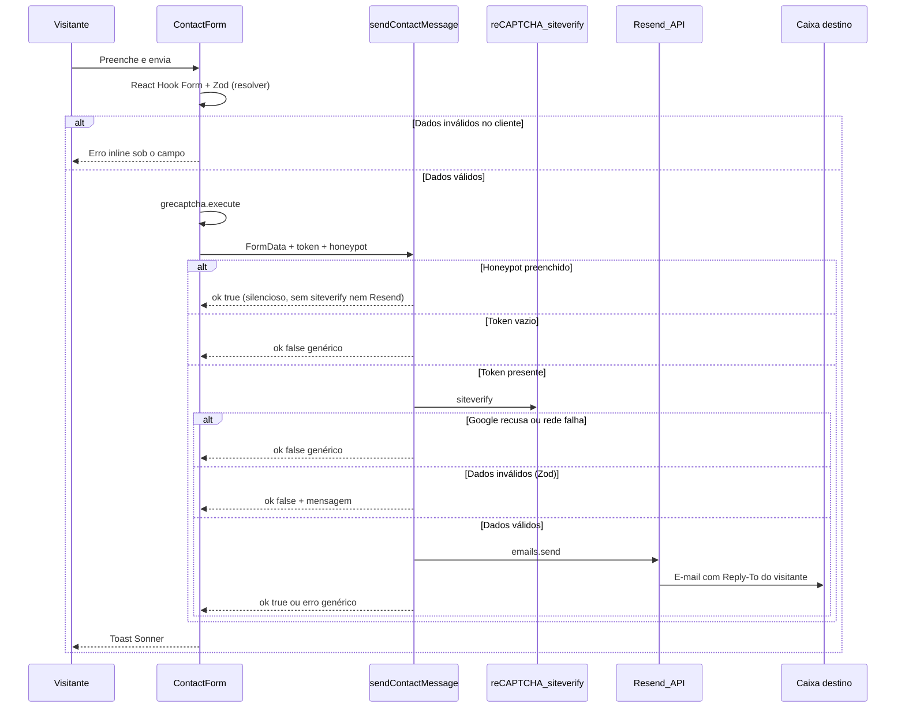

# Formulário de contato — envio de e-mail com Resend

> Documentação técnica e operacional da feature de contato do portal Observatório Brasileiro de Governo Digital (OBGD).
>
> **Rota pública:** [`/contato`](../src/app/(app)/contato/page.tsx)
>
> **Última atualização:** 2026-09-13
>
> **Manutenção:** este arquivo é a fonte de verdade da feature. Leia a seção 7 (anti-abuso) e a 7.1 (reCAPTCHA) antes de alterar o formulário, a CSP ou as keys.

---

## 1. Visão geral

Visitantes enviam mensagens pelo formulário em `/contato`. O backend valida os dados em uma **Server Action** do Next.js e dispara o e-mail via **[Resend](https://resend.com)** para a caixa institucional configurada (produção: `mbc@mbc.org.br`).

Não há persistência em banco ou CMS: o canal de entrega é apenas o e-mail. O visitante pode responder diretamente porque o campo **Reply-To** é o endereço informado no formulário.

| Aspecto | Decisão |
| --- | --- |
| Provedor | Resend (API HTTP) |
| Integração | Server Action (`'use server'`) |
| Destino (produção) | `mbc@mbc.org.br` |
| Persistência | Nenhuma (somente e-mail) |
| Anti-spam | Honeypot oculto + Google reCAPTCHA v2 Invisible (verificação no servidor) |
| Validação | Zod (`contactFormSchema`) + React Hook Form no cliente; Zod de novo na Server Action |
| UX de erro | Mensagens inline abaixo de cada campo (cliente); toast só para falha de envio |

---

## 2. Arquitetura



### Fluxo resumido

1. O cliente valida com React Hook Form + `zodResolver(contactFormSchema)` e mostra erros sob cada campo.
2. Se válido, executa o reCAPTCHA v2 Invisible, monta `FormData` (honeypot + token) e chama `sendContactMessage`.
3. A action, **nessa ordem**: honeypot → token vazio? recusa local : `siteverify` → Zod → Resend. Não pule a verificação no servidor.
4. Em sucesso, chama `resend.emails.send` com texto + HTML escapado.
5. O formulário limpa os campos (incluindo remount do Select de assunto), faz `grecaptcha.reset` e exibe toast.

---

## 3. Arquivos envolvidos

| Arquivo | Papel |
| --- | --- |
| [`src/app/(app)/contato/page.tsx`](../src/app/(app)/contato/page.tsx) | Página `/contato` (layout + formulário + `next/script` com nonce) |
| [`src/components/content/contact-form.tsx`](../src/components/content/contact-form.tsx) | UI (React Hook Form), erros inline, toasts, honeypot, reCAPTCHA, reset do Select |
| [`src/app/actions/contact.ts`](../src/app/actions/contact.ts) | Server Action: honeypot + reCAPTCHA + Zod + envio Resend |
| [`src/lib/contact.ts`](../src/lib/contact.ts) | `SUBJECT_OPTIONS`, limites, schema Zod e `parseContactFormData` |
| [`src/lib/recaptcha.ts`](../src/lib/recaptcha.ts) | `verifyRecaptchaToken` (`siteverify`, `server-only`) |
| [`src/lib/security-headers.ts`](../src/lib/security-headers.ts) | CSP extra de reCAPTCHA só em `/contato` (`isContatoPath` + `buildCsp`) |
| [`src/types/grecaptcha.d.ts`](../src/types/grecaptcha.d.ts) | Tipos de `window.grecaptcha` (render explícito v2) |
| [`.env.example`](../.env.example) | Modelo das variáveis de ambiente |
| `.env` | Segredos locais (**não versionar**) |

Dependências npm: `resend`, `zod`, `react-hook-form`, `@hookform/resolvers`. Sem pacote de wrapper do reCAPTCHA.

---

## 4. Campos do formulário

| Campo | `name` | Obrigatório | Observações |
| --- | --- | --- | --- |
| Nome completo | `name` | Sim | Máx. 120 caracteres |
| E-mail | `email` | Sim | Máx. 254; formato básico `x@y.z` |
| Assunto | `subject` | Sim | Deve ser um de `SUBJECT_OPTIONS` |
| Mensagem | `message` | Sim | Máx. 5000 caracteres |
| Honeypot | `company_url_hp` | — | Oculto; se preenchido, sucesso silencioso sem envio |
| Token reCAPTCHA | `recaptcha_token` | Sim | Gerado no cliente; verificado no servidor via `siteverify` |

### Assuntos permitidos

Definidos em `src/lib/contact.ts`:

- Dúvida geral
- Indicadores e dados
- Imprensa
- Parcerias
- Outro assunto

Para incluir/remover opções, altere `SUBJECT_OPTIONS` (UI e validação do servidor usam a mesma lista).

### Assunto do e-mail enviado

```
[Contato OBGD] {assunto} — {nome}
```

O corpo inclui nome, e-mail, assunto e mensagem (versão texto e HTML). O HTML escapa caracteres especiais para mitigar XSS no cliente de e-mail.

---

## 5. Variáveis de ambiente

| Variável | Obrigatória | Descrição |
| --- | --- | --- |
| `RESEND_API_KEY` | Sim | API key do Resend (`re_…`) |
| `RESEND_FROM_EMAIL` | Sim | Remetente no formato `Nome <email@dominio>` |
| `CONTACT_TO_EMAIL` | Sim | Destinatário das mensagens |
| `NEXT_PUBLIC_RECAPTCHA_SITE_KEY` | Sim | Site key pública do reCAPTCHA v2 Invisible |
| `RECAPTCHA_SECRET_KEY` | Sim | Secret do reCAPTCHA (só servidor; fail-closed se ausente) |

Exemplo em `.env.example`:

```bash
RESEND_API_KEY=
RESEND_FROM_EMAIL=Observatorio <onboarding@resend.dev>
CONTACT_TO_EMAIL=mbc@mbc.org.br
NEXT_PUBLIC_RECAPTCHA_SITE_KEY=
RECAPTCHA_SECRET_KEY=
```

Em desenvolvimento local, use as [keys de teste do Google](https://developers.google.com/recaptcha/docs/faq) (sempre passam em `localhost`). Sem as duas keys, o envio falha com a mensagem genérica.

### Comportamento se faltar configuração

A action registra erro no servidor (`Contact form misconfigured…` ou `missing RECAPTCHA_SECRET_KEY`) e devolve ao usuário apenas:

> Não foi possível enviar a mensagem. Tente novamente mais tarde.

Detalhes internos (chave ausente, resposta da API) **não** são expostos no toast.

---

## 6. Configuração

### 6.1 Desenvolvimento local

1. Crie conta em [resend.com](https://resend.com) e gere uma API key.
2. Copie `.env.example` → `.env` (ou complete o `.env` existente).
3. Preencha:

```bash
RESEND_API_KEY=re_sua_chave_real
RESEND_FROM_EMAIL=Observatorio <onboarding@resend.dev>
CONTACT_TO_EMAIL=seu-email-da-conta-resend@exemplo.com
NEXT_PUBLIC_RECAPTCHA_SITE_KEY=6LeIxAcTAAAAAJcZVRqyHh71UMIEGNQ_MXjiZKhI
RECAPTCHA_SECRET_KEY=6LeIxAcTAAAAAGG-vFI1TnRWxMZNFuojJ4WifJWe
```

4. Reinicie `npm run dev` após alterar o `.env` (o Next recarrega env, mas um restart evita estado antigo).
5. Abra `http://localhost:3000/contato`, envie uma mensagem e confira a caixa de destino (e spam).

**Limitação do modo teste:** com `onboarding@resend.dev`, o Resend só entrega para o **e-mail da conta Resend**. Não use `mbc@mbc.org.br` como `CONTACT_TO_EMAIL` até haver domínio verificado — o envio falha ou não chega ao destinatário institucional.

### 6.2 Produção

1. No Resend, verifique o domínio de envio (ex.: `mbc.org.br` ou domínio do Observatório).
2. Configure DNS (SPF, DKIM; DMARC recomendado) conforme o painel Resend.
3. Defina no ambiente de deploy:

```bash
RESEND_API_KEY=re_...
RESEND_FROM_EMAIL=Observatório <noreply@seu-dominio-verificado>
CONTACT_TO_EMAIL=mbc@mbc.org.br
NEXT_PUBLIC_RECAPTCHA_SITE_KEY=site_key_de_producao
RECAPTCHA_SECRET_KEY=secret_de_producao
```

No [admin do reCAPTCHA](https://www.google.com/recaptcha/admin), crie uma chave **v2 Invisible** (não v3) com os domínios de produção. Inclua `localhost` só se for testar a chave real no dev. **Não** use as keys de teste do FAQ fora de `localhost` — elas sempre passam, inclusive com token lixo.

4. Confirme saída HTTPS do host para a API do Resend **e** para `https://www.google.com/recaptcha/api/siteverify`.
5. Faça um envio real pela página `/contato` e valide Reply-To respondendo ao e-mail recebido.
6. Após o deploy, **Rescan** no [MDN Observatory](https://developer.mozilla.org/en-US/observatory/analyze?host=observatorio-gov-digital.vercel.app) (a CSP de `/contato` mudou). Ao migrar de domínio (Insper → AWS), acrescente o host novo no admin do reCAPTCHA **antes** de apontar o DNS.

### 6.3 Segurança das chaves

- Nunca commitar `.env` nem expor `RESEND_API_KEY` ou `RECAPTCHA_SECRET_KEY` em issues, chats ou capturas.
- Se a key Resend vazar, **revogue e gere outra** no dashboard Resend. Se o secret do reCAPTCHA vazar, recrie o par site/secret no [admin do Google](https://www.google.com/recaptcha/admin) e atualize as duas env vars no mesmo deploy (`NEXT_PUBLIC_*` exige rebuild).
- Prefira secrets do provedor de hospedagem em produção (não arquivo `.env` no repositório).

---

## 7. Segurança e anti-abuso

| Medida | Detalhe |
| --- | --- |
| Server-side only | Keys Resend e `RECAPTCHA_SECRET_KEY` só no servidor; o browser não as recebe |
| Validação no servidor | Campos, e-mail, assunto allowlist, limites de tamanho |
| Honeypot | Campo `company_url_hp` oculto; nome pouco comum para evitar autofill do browser |
| reCAPTCHA v2 Invisible | Token no submit; `siteverify` no servidor antes do Resend. Sem token / recusa / secret ausente → erro genérico, sem e-mail |
| CSP | `frame-src` / `connect-src` / `img-src` do Google só em `/contato` (e `/v2/contato`). `script-src` continua nonce + `strict-dynamic` |
| Aviso Google / LGPD | Texto obrigatório sob o formulário (badge do reCAPTCHA oculto) |
| Erros genéricos | Toasts não revelam causa interna |
| Escape HTML | Conteúdo do visitante escapado no corpo HTML |
| Reply-To | Resposta vai ao visitante; o From continua sendo o domínio Resend/verificado |

**Fora do escopo atual:** rate limiting por IP, fila, retenção em banco, webhook de bounce. As vars `UPSTASH_*` em `.env.example` são residual — **não há código** que as leia.

### 7.1 reCAPTCHA v2 Invisible — manutenção

Decisão: widget invisível (sem checkbox; o Google só mostra desafio se suspeitar) + honeypot. Verificação **sempre** no servidor. Fail-closed (sem secret, sem token ou `success !== true` → não envia).

| Decisão | Por quê | Não faça |
| --- | --- | --- |
| Sem `react-google-recaptcha` | Essas libs injetam `<script>` sem nonce e quebram o `script-src` atual (`nonce` + `strict-dynamic`) | Adicionar wrapper npm “para facilitar” |
| `next/script` só em `/contato` | O `api.js` não deve ir para o resto do portal | Colocar o Script no root layout |
| Render explícito (`?render=explicit`) | `grecaptcha.render` + `execute(widgetId)` no submit, depois do Zod cliente | Trocar para v3 (`execute(siteKey, { action })`) sem reescrever cliente **e** servidor |
| `grecaptcha.reset` após sucesso **e** falha | Token v2 é uso único | Reutilizar o mesmo token num retry |
| CSP extra só em `/contato` (`isContatoPath`) | Não abrir `frame-src` do Google no portal inteiro | Copiar origens Google para o CSP global “por garantia” |
| Badge oculto (`.grecaptcha-badge { visibility: hidden }`) | Visual do portal; o Google **exige** o texto com links de privacidade/termos no form | Esconder o badge **e** remover o aviso |
| Sem `'unsafe-inline'` em `script-src` | Derruba a nota A+ do Observatory (−20) | Afrouxar `script-src` para “fazer o widget aparecer” |

**Cliente** ([`contact-form.tsx`](../src/components/content/contact-form.tsx)): `waitForGrecaptcha` → `render({ size: 'invisible' })` → no submit, Promise em torno de `execute` (timeout 15 s). Se o widget não renderizar, o submit falha fechado (toast genérico). Tipos em `src/types/grecaptcha.d.ts`.

**Servidor** ([`recaptcha.ts`](../src/lib/recaptcha.ts)): `POST https://www.google.com/recaptcha/api/siteverify` com `secret` + `response`. Token vazio **não** chama o Google. `server-only` — não importe esse módulo em Client Component.

**CSP** ([`security-headers.ts`](../src/lib/security-headers.ts)), só quando `isContatoPath` é verdadeiro:

- `frame-src`: `https://www.google.com/recaptcha/` `https://recaptcha.google.com/`
- `connect-src` / `img-src`: os mesmos + `https://www.gstatic.com/recaptcha/`
- `script-src` não ganha host extra: o loader entra com nonce; `strict-dynamic` cobre os scripts filhos do Google.

**Keys de teste do Google** (documentadas no FAQ): em `localhost` o `siteverify` devolve `success: true` **mesmo com token inválido**. Sirvem para desenvolver o fluxo, não para provar rejeição. Para testar falha de token: omita o campo `recaptcha_token` (DevTools / chamada direta à action) ou use a chave real de produção.

**Rotacionar keys / novo domínio:** recrie o par no admin v2 Invisible → atualize `NEXT_PUBLIC_RECAPTCHA_SITE_KEY` e `RECAPTCHA_SECRET_KEY` no mesmo deploy → rebuild (a site key é pública e entra no bundle) → teste `/contato`. Ao publicar um host novo, cadastre-o no admin **antes** do cutover.

---

## 8. UX e comportamentos do formulário

- Validação no submit via React Hook Form + Zod; erros aparecem **abaixo de cada campo** (borda `aria-invalid`).
- `noValidate` no `<form>` para não misturar validação nativa do browser com as mensagens inline.
- Loading no botão (`Enviando…`) enquanto a action roda.
- Toasts via Sonner para **sucesso** e **falha de envio** (não para validação de campo).
- Após sucesso: `reset()` do RHF, limpa estado e **remonta** o Select Radix (`key` incrementada) para voltar ao placeholder.
- Fallback humano: link `mailto:mbc@mbc.org.br` ao lado do botão Enviar.
- Aviso de que o site é protegido pelo reCAPTCHA, com links para a política de privacidade e os termos do Google.

---

## 9. Testes manuais sugeridos

| Caso | Resultado esperado |
| --- | --- |
| Envio completo válido | Toast de sucesso; e-mail na caixa destino; formulário limpo (assunto no placeholder) |
| Assunto vazio | Erro inline “Selecione um assunto.” sob o Select |
| E-mail inválido | Erro inline “Informe um e-mail válido.” sob o campo |
| Env vars ausentes (Resend ou reCAPTCHA) | Toast genérico; log no servidor |
| Honeypot preenchido (DevTools, `#company_url_hp`) | Toast de sucesso; action ~0 ms; **sem** `siteverify` e **sem** Resend |
| Token reCAPTCHA omitido (chamada direta à action) | Toast genérico; action ~0–2 ms; sem e-mail |
| Token inválido com **chave real** (não a de teste) | Toast genérico; `siteverify` com `success: false`; sem e-mail |
| Keys de teste + token lixo | **Passa** (limitação do Google). Não use isso como prova de rejeição |
| Keys reCAPTCHA ausentes | Toast genérico; log `missing RECAPTCHA_SECRET_KEY` |
| Reply no e-mail recebido | Resposta endereçada ao e-mail do visitante |

Checklist rápido em `/contato` após deploy ou mudança de env:

1. Enviar mensagem de teste com assunto “Dúvida geral”.
2. Confirmar assunto `[Contato OBGD] …` e corpo legível.
3. Usar “Responder” e checar o destinatário (Reply-To).
4. Confirmar que o Select de assunto volta ao placeholder.
5. Console sem violação de CSP; aviso do Google visível sob o botão.

---

## 10. Troubleshooting

| Sintoma | Causas prováveis | O que fazer |
| --- | --- | --- |
| Toast de sucesso, e-mail não chega | Destino ≠ e-mail da conta Resend no modo `onboarding@resend.dev`; spam; domínio não verificado | Ajustar `CONTACT_TO_EMAIL`; verificar pasta de spam; verificar domínio |
| Toast genérico de falha | Key Resend inválida; From não autorizado; rede bloqueada; reCAPTCHA recusou / secret ausente; widget não carregou | Ver logs (`Resend error:` / `missing RECAPTCHA_SECRET_KEY` / `reCAPTCHA siteverify`); validar env; console do browser |
| POST `/contato` em ~0–2 ms, toast de **sucesso**, sem e-mail | Honeypot disparou | `#company_url_hp` preenchido (autofill). Não usar nomes tipo `website` |
| POST `/contato` em ~0–2 ms, toast de **erro** | Token omitido ou secret ausente (sem ida ao Google) | Inspecionar `recaptcha_token` no FormData; conferir `RECAPTCHA_SECRET_KEY` |
| POST ~centenas de ms, toast de erro, sem e-mail | `siteverify` recusou ou Resend falhou | Distinguir nos logs: `reCAPTCHA siteverify` vs `Resend error:` |
| Console: violação de CSP no reCAPTCHA | CSP sem origens Google na rota; script sem nonce | `isContatoPath` + `buildCsp({ recaptcha: true })`; `next/script` com `x-nonce`; não carregar o script em outra página |
| Widget não aparece / submit falha imediato | Site key vazia; script bloqueado; `grecaptcha` ainda não ready | `NEXT_PUBLIC_RECAPTCHA_SITE_KEY` no `.env` + **restart** do `next dev`; Network tab no `api.js` |
| Env “parece” certo mas app ignora | Dev server sem reload após editar `.env` | Reiniciar `npm run dev` |
| Select de assunto permanece preenchido | Bug de reset Radix | Garantir incremento de `subjectKey` após sucesso (já implementado) |

**Nota sobre logs do Next:** a action pode aparecer como `sendContactMessage({})` no terminal mesmo com `FormData` preenchido — o console não serializa `FormData` como JSON. Use a duração da request (~centenas de ms a ~1s com rede) como indício de chamada real à API.

---

## 11. Operação e ownership

| Item | Responsável sugerido |
| --- | --- |
| Conta Resend / API keys | Time técnico Insper / MBC (definir owner) |
| Conta Google reCAPTCHA (admin, keys, domínios) | Time técnico Insper / MBC (definir owner; a site key é do **projeto**, não pessoal) |
| DNS do domínio de envio | Time de infra / TI do dono do domínio |
| Caixa `mbc@mbc.org.br` (triagem) | MBC / equipe de contato do Observatório |
| Código do formulário + CSP | Engenharia (`observatorio-gov-digital`) |

Hospedagem atual: Insper; migração futura para AWS (MBC). A integração Resend é HTTP e não depende de SMTP local — desde que haja saída HTTPS e secrets corretos no ambiente.

---

## 12. Evoluções possíveis (fora do escopo atual)

- Rate limiting por IP se houver abuso residual
- Cópia ou arquivamento em CMS/banco para auditoria
- Amazon SES após migração AWS (se o time preferir stack unificada)
- Templates React Email no Resend
- Notificação Slack/Teams além do e-mail

---

## 13. Referências

- [Resend — documentação](https://resend.com/docs)
- [Resend — verificação de domínio](https://resend.com/docs/dashboard/domains/introduction)
- [reCAPTCHA v2 Invisible](https://developers.google.com/recaptcha/docs/invisible)
- [Next.js — Server Actions](https://nextjs.org/docs/app/building-your-application/data-fetching/server-actions-and-mutations)
- Variáveis de ambiente do projeto: [`.env.example`](../.env.example)
- Headers / CSP: [`security-headers-observatory.md`](./security-headers-observatory.md)
- Acompanhamento geral da plataforma: [`acompanhamento-plataforma.md`](./acompanhamento-plataforma.md)
