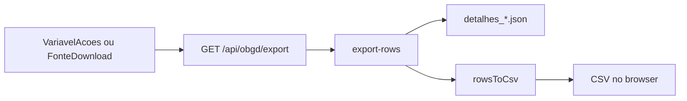

# Download de variáveis — CSV do OBGD

> Documentação da feature de export CSV no portal Observatório Brasileiro de Governo Digital (OBGD).
>
> **Endpoint:** `GET /api/obgd/export`
>

---

## 1. Visão geral

O visitante baixa um **recorte curado** dos dados usados no índice: valores **normalizados** (0–100) do snapshot OBGD, enriquecidos com metadados de ente, objetivo e fonte.

A plataforma **não** hospeda microdados brutos das fontes oficiais. O CSV é gerado no servidor a partir dos assets `detalhes_*.json` — o browser só faz `fetch` e salva o arquivo.

Os **links oficiais** da edição usada no índice (zip, xlsx, PDF, API) são outro fluxo: catálogo, UI e como atualizar estão em [`fontes-acesso-oficial.md`](./fontes-acesso-oficial.md). No diálogo de `VariavelAcoes` e na página da fonte os dois convive — CSV do OBGD **e** lista oficial.

| Aspecto   | Decisão                                               |
| --------- | ------------------------------------------------------ |
| Geração | Server-side (Route Handler Next.js)                    |
| Origem    | `detalhes_{nacional,estadual,capitais}.json`         |
| Conteúdo | Recorte do índice (normalizado), não microdado bruto |
| Formato   | UTF-8 + BOM, separador`,`, Excel-friendly            |
| Schema    | Colunas fixas (sem seletor na UI)                      |

---

## 2. Onde aparece na UI

| Entrada                                                  | Componente                  | Comportamento                                                                            |
| -------------------------------------------------------- | --------------------------- | ---------------------------------------------------------------------------------------- |
| Lista de variáveis (ranking / indicadores por objetivo) | `VariavelAcoes`           | Ícone externo → arquivo oficial primário; ícone de download → diálogo com CSV do OBGD **e** lista de dados oficiais da fonte |
| Página de fonte (`/metodologia/fontes/[fonteId]`) | `FonteContent` + `ObgdFonteDownloadButton` | Lista de arquivos oficiais da edição usada no índice; botão “Baixar CSV do OBGD”, só se `hasObgdExportForFonteId` for verdadeiro |

---

## 3. Fluxo

1. O cliente chama `GET /api/obgd/export` com os query params do modo escolhido.
2. A rota filtra e mapeia linhas em `export-rows.ts` a partir de `detalhesForNivel()`.
3. `rowsToCsv` serializa o schema fixo (UTF-8 + BOM).
4. A resposta vem como `text/csv` com `Content-Disposition: attachment`.
5. O cliente cria um Blob e dispara o download pelo nome do header (fallback no nome preview da UI).

---

## 4. Arquivos-chave

| Papel                         | Caminho                                                                                                                      |
| ----------------------------- | ---------------------------------------------------------------------------------------------------------------------------- |
| Rota API                      | [`src/app/api/obgd/export/route.ts`](../src/app/api/obgd/export/route.ts)                                                   |
| Filtro / mapeamento de linhas | [`src/data/obgd/export-rows.ts`](../src/data/obgd/export-rows.ts)                                                           |
| Serializer CSV                | [`src/lib/export-obgd-csv.ts`](../src/lib/export-obgd-csv.ts)                                                               |
| Assets de origem              | `src/data/obgd/assets/detalhes_{nacional,estadual,capitais}.json`                                                          |
| UI variável                  | [`src/components/shared/variavel-acoes.tsx`](../src/components/shared/variavel-acoes.tsx)                                   |
| UI fonte                      | [`src/components/metodologia/obgd-fonte-download-button.tsx`](../src/components/metodologia/obgd-fonte-download-button.tsx) |
| Links oficiais (não é este CSV) | [`docs/fontes-acesso-oficial.md`](./fontes-acesso-oficial.md) · [`src/data/obgd/fonte-urls.ts`](../src/data/obgd/fonte-urls.ts) |

---

## 5. Modos de export

| Query                                               | Escopo                                                 | Exemplo                                                  |
| --------------------------------------------------- | ------------------------------------------------------ | -------------------------------------------------------- |
| `nivel` + `conceptId` (+ `subItens` opcional) | Indicador em todas as unidades daquele nível          | `/api/obgd/export?nivel=estadual&conceptId=tic_gov/B1` |
| `fonteId`                                         | Indicadores de uma fonte OBGD (pesquisa), nos 3 níveis | `/api/obgd/export?fonteId=munic`                     |
| `metodologiaSlug` (legado)                        | Indicadores agregados por órgão (várias pesquisas)    | `/api/obgd/export?metodologiaSlug=cetic-br`            |

A UI das páginas `/metodologia/fontes/[fonteId]` usa **`fonteId`** (uma pesquisa, ex. `munic`). O parâmetro `metodologiaSlug` permanece na API por compatibilidade; o mapa slug → ids fica em `METODOLOGIA_SLUG_PARA_FONTE_IDS` (`export-rows.ts`). Fontes sem linhas em `detalhes_*` (ou lista vazia, ex.: `cgu`) não exibem o botão / respondem 404.

**Erros comuns:** `400` parâmetros inválidos; `404` sem linhas ou fonte sem mapeamento.

---

## 6. Schema do CSV

Colunas (ordem fixa):

`nivel`, `unidade`, `unidade_nome`, `objetivo`, `objetivo_nome`, `concept_id`, `fonte_id`, `fonte_nome`, `indicador`, `sub_itens`, `descricao`, `escala`, `populacao`, `valor_normalizado`, `ano_fonte`, `ano_indice`

- Separador: `,`
- Encoding: UTF-8 com BOM (`\uFEFF`) para abrir bem no Excel
- Células nulas → string vazia; aspas / vírgulas / quebras de linha escapadas no estilo RFC
- `ano_indice` usa a constante do app (`ANO_INDICE`, edição 2026)

---

## 7. Nomenclatura dos arquivos

| Modo         | Padrão                             | Exemplo                          |
| ------------ | ----------------------------------- | -------------------------------- |
| Por conceito | `obgd-{nivel}-{slug-concept}.csv` | `obgd-estadual-tic-gov-b1.csv` |
| Por fonte    | `obgd-fonte-{slug-id}.csv`        | `obgd-fonte-tic-gov.csv`       |

O slug remove acentos, lower-case, não-alfanuméricos → `-` (máx. 80 caracteres).

---

## 8. Status / alinhamento

| Item                                                                                  | Status                            |
| ------------------------------------------------------------------------------------- | --------------------------------- |
| Implementação no front (API + UI + serializer)                                      | Feito                             |
| Conteúdo = recorte normalizado de`detalhes_*`                                      | Feito (conforme dados fornecidos) |
| Validação com a frente de dados (Gabriel): schema, escopo do recorte e nomenclatura | **Pendente**                |
