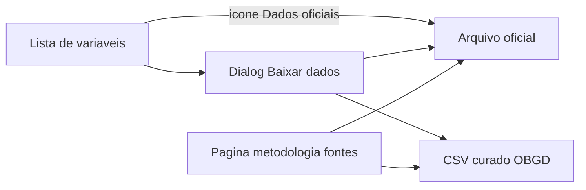

# Acesso oficial às fontes — links de download

> Documentação do catálogo e da UI que levam o visitante ao **arquivo oficial da edição usada no índice** (não à home do órgão).
>
> **Catálogo:** [`src/data/obgd/fonte-urls.ts`](../src/data/obgd/fonte-urls.ts)
>
> **Última atualização:** 2026-09-12
>
> Relacionado: o CSV curado do Observatório (recorte normalizado) está em [`export-csv-obgd.md`](./export-csv-obgd.md). São dois downloads distintos.

---

## 1. Visão geral

A plataforma **não hospeda** microdados brutos. Oferece duas coisas:

| O que | Onde | Conteúdo |
| --- | --- | --- |
| CSV do OBGD | `GET /api/obgd/export` | Recorte normalizado (0–100) usado no índice |
| Link oficial | catálogo `FONTES_ACESSO` | Endereço do órgão na edição usada (zip, xlsx, PDF ou API) |

O pedido de produto (Gabriel): os links das fontes estavam escondidos (ícone comentado) e apontavam para a home do órgão. Agora o CTA principal é o arquivo da edição.



---

## 2. Modelo de dados

Tudo vive em [`fonte-urls.ts`](../src/data/obgd/fonte-urls.ts). Não duplicar URLs em outro arquivo.

```ts
type FonteAcessoTipo = 'download_livre' | 'solicitacao' | 'painel'

type FonteArquivo = { label: string; url: string; tipo: FonteAcessoTipo }

type FonteAcesso = {
  urlPesquisa: string   // landing da pesquisa (CTA secundário)
  arquivos: FonteArquivo[]
}
```

| Campo | Uso |
| --- | --- |
| `urlPesquisa` | Botão “Acessar página da pesquisa” em `/metodologia/fontes/[fonte]`. Fallback do ícone se não houver arquivo. |
| `arquivos[]` | Lista de download/acesso da **edição usada no índice**. Pode ter 0, 1 ou N itens. |
| `label` | Texto do link (ex. “Tabelas ODS 2023 — prefeituras”). |
| `tipo` | Rótulo na UI via `FONTE_ACESSO_TIPO_LABEL`. |

Helpers:

| Função | Comportamento |
| --- | --- |
| `arquivosDaFonte(id)` | `arquivos` ou `[]` |
| `acessoDaFonte(id)` | Entrada completa ou `undefined` |
| `urlFontePrimaria(id)` | 1º arquivo → senão `urlPesquisa` → senão `https://www.gov.br/` |
| `FONTE_URLS` | Alias `{ [id]: urlFontePrimaria(id) }` para call sites antigos (`server.ts`, `tag-variaveis.ts`) |

O site do órgão (`urlOrgao`) **não** entra neste catálogo: fica em [`src/data/fontes.ts`](../src/data/fontes.ts) (`ORGAO_URL_POR_INSTITUICAO`).

### Tipos

| `tipo` | Rótulo na UI | Quando usar |
| --- | --- | --- |
| `download_livre` | Download livre | Zip, xlsx, PDF, txt de acesso direto |
| `painel` | Painel / API | Endpoint ou painel (hoje: `sgd_sat`) |
| `solicitacao` | Sob solicitação | Reservado. Nenhum item nesta edição. |

CETIC: os zips catalogados são **tabelas ODS públicas**, não o microdado unitário que pede Termo NIC.br (metodologia, cap. 3). Nos `label`, usar “Tabelas ODS”, não “microdados unitários”.

---

## 3. Onde aparece na UI

As chips de [`FontesRecorte`](../src/components/shared/fontes-recorte.tsx) continuam indo para `/metodologia/fontes/{id}` (catálogo interno). O download oficial está nas superfícies abaixo.

| Superfície | Componente | Comportamento |
| --- | --- | --- |
| Lista de variáveis (drilldown do ente e explorador de indicadores por tag) | [`VariavelAcoes`](../src/components/shared/variavel-acoes.tsx) | Ícone externo (`aria-label` “Dados oficiais da fonte”) → `fonteUrl` = `urlFontePrimaria`. Diálogo “Baixar dados”: CSV do OBGD **e** seção “Dados oficiais da fonte” com todos os `arquivos`. Se `arquivos` estiver vazio, um link “Página da pesquisa”. |
| Página da fonte | [`FonteContent`](../src/components/metodologia/fonte-content.tsx) | Bloco “Baixar dados oficiais (edição usada no índice)” + CTAs secundários “Acessar página da pesquisa” / “Site do órgão”. CSV do OBGD no bloco de baixo, se houver export. |

`VariavelAcoes` recebe `fonteId` (já existe em `Variavel`; também em `TagVariavelComNotas`) para montar a lista. Não inventar URL por indicador: o catálogo é **por fonte**.

---

## 4. Catálogo desta edição

IDs = `fonte.id` em `fonte.json`. URLs canônicas só em `FONTES_ACESSO` — a tabela abaixo é o mapa de conteúdo, não um segundo registro de href.

| `fonteId` | Edição | `arquivos` | Observação |
| --- | --- | --- | --- |
| `tic_gov` | 2023 | 2 zips ODS (órgãos fed./estaduais; prefeituras) | |
| `tic_saude` | 2024 | 1 zip ODS (estabelecimentos) | |
| `tic_educacao` | 2024 | 1 zip ODS (escolas) | |
| `tic_cultura` | 2024 | 1 zip ODS | Catalogada; sem indicador ativo nesta edição |
| `tic_domicilios` | 2024 | 1 zip ODS (indivíduos) | Idem |
| `iesgo` | 2024 | **nenhum** | Só `urlPesquisa` = portal TCU, até a frente de dados mandar URL de download |
| `iospd` | 2025 | xlsx detalhado + PDF do relatório | Landing: `abep-tic.org.br/indice-abep-2025/` |
| `anatel` | 2025 | 2 zips (banda larga fixa; cobertura móvel) | Ícone usa o 1º (banda larga) |
| `censo_escolar` | 2024 | zip de microdados INEP | |
| `pnad_tic` | 2024 | zip 4º trim. + arquivo de input/sintaxe | |
| `sgd_sat` | 2025 | API de avaliação (`painel`) | Não rotular como microdado |
| `munic` | 2024 | xlsx FTP IBGE | |
| `estadic` | 2024 | xlsx FTP IBGE | |
| `igovsisp` | 2025 | PDF do autodiagnóstico SISP | |

---

## 5. Como atualizar (edição seguinte)

1. Pedir à frente de dados, por fonte: `fonteId` · ano · URL de download/acesso · `tipo`.
2. Editar só [`fonte-urls.ts`](../src/data/obgd/fonte-urls.ts): `urlPesquisa` e `arquivos[]`.
3. Ajustar `label` para a nova edição (ano no texto).
4. Se uma fonte ficar sem arquivo (como iESGo hoje), deixar `arquivos: []` e uma `urlPesquisa` útil — a UI cai no fallback.
5. Não commitar cópia das bases oficiais no repo.

A UI (`VariavelAcoes`, `FonteContent`, `fontes.ts`) lê o catálogo; em geral não precisa mudar.

---

## 6. Arquivos-chave

| Papel | Caminho |
| --- | --- |
| Catálogo + helpers | [`src/data/obgd/fonte-urls.ts`](../src/data/obgd/fonte-urls.ts) |
| Tipo `Fonte` + `urlOrgao` | [`src/data/fontes.ts`](../src/data/fontes.ts) |
| Ícone + diálogo | [`src/components/shared/variavel-acoes.tsx`](../src/components/shared/variavel-acoes.tsx) |
| Página `/metodologia/fontes/[fonte]` | [`src/components/metodologia/fonte-content.tsx`](../src/components/metodologia/fonte-content.tsx) |
| `fonteUrl` no drilldown | [`src/data/obgd/server.ts`](../src/data/obgd/server.ts) |
| `fonteUrl` / `fonteId` nas tags | [`src/data/obgd/tag-variaveis.ts`](../src/data/obgd/tag-variaveis.ts) |

---

## 7. Status

| Item | Status |
| --- | --- |
| Catálogo tipado + UI (ícone, diálogo, página da fonte) | Feito (2026-09-12) |
| URLs da edição atual (lista Gabriel) | Feito, exceto iESGo |
| URL de download do iESGo (TCU 2024) | Pendente — manter landing |
| Tipo `solicitacao` em uso | Não |
